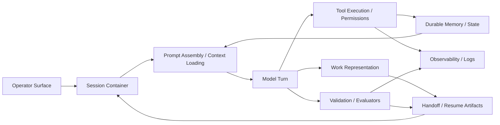

# Agent Harness Anatomy

## Definition
An agent harness is the infrastructure around the model: state containers, tool execution, memory, review loops, work representation, and operator surfaces. The model writes sentences; the harness decides whether those sentences become durable work or expensive compost.

## Structural map

## Common components
Across the sources in this wiki, a mature harness usually contains at least these parts:
1. Session containers such as threads, turns, or resumable runs.
2. Prompt assembly and context-loading rules.
3. Tool execution, approval, and [[safety-and-permissions]] machinery.
4. Durable memory or state artifacts.
5. Work representations such as beads, feature lists, or plans.
6. Validation and evaluator loops.
7. Handoff or resume mechanisms.
8. Human control surfaces and client integrations, ideally capable of showing branches, checkpoints, and evidence rather than only a scrolling transcript.
9. Observability, logging, and debugging hooks.
10. Coordination roles or [[orchestration-topologies]].

## Representative implementations
[[codex-cli]] emphasizes clean protocol boundaries and client separation.
[[codex-app-server]] makes those boundaries explicit at the protocol layer.
[[claude-code]] emphasizes handoff artifacts, evaluators, hooks, and a documented split between subagents and separate-session agent teams.
[[hermes-agent]] emphasizes persistence, skill accumulation, API-serving, and multi-surface continuity.
[[gas-town]] and [[gas-city]] emphasize explicit work graphs and multi-agent orchestration as the primary product.

## Why anatomy matters
Without structural decomposition, discussions about agents collapse into model talk. The sources here suggest the opposite lesson: many practical wins come from changing the harness rather than changing the model. That is the central claim of [[harness-engineering]]. The newer arXiv material extends this point into semantics: anatomy is what later supports [[probabilistic-epistemic-updates]] and [[partial-order-trace-semantics]] rather than remaining a mere inventory. The latest interface pass adds a further claim: surfaces themselves are part of the harness architecture, not cosmetic wrappers. See [[non-linear-interface-options-for-next-harness]].

## Related pages
Use this page as the map before reading [[orchestration-topologies]], [[harness-architecture-comparison]], [[context-engineering]], [[safety-and-permissions]], [[work-management-primitives]], or [[non-linear-interface-options-for-next-harness]].
