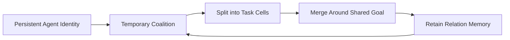

# Fission-Fusion Orchestration

## Definition
Fission-fusion orchestration treats teams as dynamic coalitions that split, recombine, and overlap while retaining stable identities and long-lived relationship memory. The governing question is not "who manages whom?" but "which coalition should exist for this phase, and what should persist when it dissolves?"

## Why dolphins matter here
The Shark Bay dolphin literature is useful because it shows a social system with all three of the properties most agent stacks usually separate:
- no clear global hierarchy
- rapid regrouping and overlapping alliance structure
- durable recognition and coalition memory across long spans

That combination is operationally interesting. If a system can split and merge quickly but cannot remember who was useful, it thrashes. If it remembers everyone but cannot recompose fluidly, it ossifies into rank.

## Structural features worth borrowing

### 1. Persistent identity with flexible grouping
The dolphin population studied by Evans et al. lives in a large open fission-fusion system with no clear social hierarchy, yet individuals still show stable social traits across decades. For agent design, that argues for stable agent IDs and relation histories even when work groups are ephemeral.

### 2. Nested team membership
King et al. show that male dolphins distinguish immediate allies from broader team membership within nested alliances. An agent runtime can use the same idea: local pairings or micro-teams may differ from the wider coalition that shares a mission, evaluator surface, or trust boundary. This is more expressive than a single parent-child tree.

### 3. Situational leadership
Lusseau and Conradt show that some dolphin group decisions become unshared consensus decisions when one individual has better knowledge. That is a better model for many agent decisions than fixed management. Leadership should attach to information advantage or local context, then disappear when the advantage disappears.

### 4. Long-lived relationship memory
Bruck's work on decades-long social memory is the missing half of flexible coordination. Recombination only works if former collaborators remain legible after separation. In harness terms this points straight at [[memory-persistence]]: coalition systems need durable records of trust, specialization, and prior joint success.

## Agent-harness translation
If this pattern were implemented seriously, the runtime would need:
- coalition objects, not only task objects
- split and merge events in the work graph
- durable agent identity and relation memory
- scoped leadership tokens for narrow decisions
- direct peer addressability so agents can recall specific collaborators instead of broadcasting everything

This makes fission-fusion orchestration adjacent to [[work-management-primitives]] and [[partial-order-trace-semantics]]. Splits and merges are graph events. They should not be hidden inside freeform chat.

## Where it beats hierarchy
Fission-fusion patterns are better when tasks repeatedly alternate between:
- loosely coupled scouting
- tight local collaboration
- reaggregation around review or integration

Typical cases are debugging, broad research, evaluator-driven refactoring, and mixed implementation/review loops where the best collaborators for one phase are not the best structure for the next. A fixed manager tree tends to over-route all of this through one session and creates needless serialization.

## Main warning
This is not a plea for zoological cosplay. The useful part is the structural lesson: stable identity plus fluid coalition boundaries plus information-scoped leadership. Without those three pieces, "fission-fusion" collapses either into chaos or into a hierarchy with extra steps.

## Related pages
Read this with [[non-hierarchical-coordination-patterns]], [[orchestration-topologies]], [[memory-persistence]], [[work-management-primitives]], [[evaluation-and-review-loops]], and [[partial-order-trace-semantics]].
