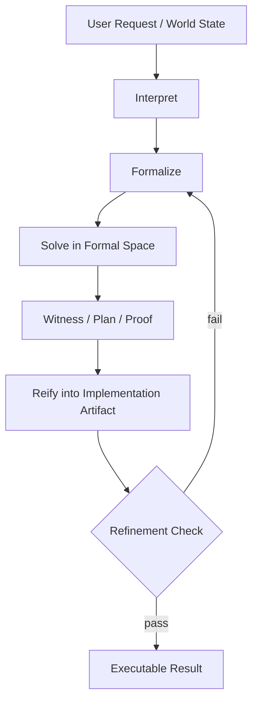

# Formal Cognition Loop

## Definition
The formal cognition loop is the architecture in which the agent tries to translate a problem into an appropriate formal space, solve or refine it there, and then project the result back into the implementation space best suited for execution. The formal space is not decoration. It is where the real cognitive work is supposed to happen.

## Loop sketch

## Canonical loop
1. **Interpret** the user request or world state.
2. **Formalize** it into a typed specification, proof goal, constraint system, planning model, or other checkable intermediate representation.
3. **Solve** in that formal space using proof search, synthesis, SMT, planning, or structured transformation.
4. **Reify** the witness back into code, prose, actions, UI changes, or another implementation artifact.
5. **Check refinement** so the reified artifact still satisfies the formal object that produced it.

## Why this is attractive
Lahiri's intent-formalization argument and the nl2postcond work by Endres et al. both point to the same conclusion: the important bottleneck is not generation fluency but translation of informal intent into something checkable. Murphy et al. reinforce this from the synthesis side: difficult parts should be routed into formal synthesis rather than asking the LLM to improvise everything. EPDDL adds a planning counterpart: even epistemic multi-agent problems benefit from a shared formal language rather than ad hoc benchmark notation.

## Candidate formal spaces
- **Proof goals** for invariants, transformations, and mathematical reasoning.
- **Postconditions / contracts** for code intent and bug-catching.
- **Constraint systems / SMT formulas** for admissibility, consistency, and search.
- **Planning languages** for action sequencing, especially where beliefs and knowledge matter.
- **Reactive or domain-specific synthesis languages** when implementation can be generated from a stronger spec.

## Design lesson
The interesting design choice is not whether to use formal methods in the abstract, but which formal space is the right narrowing move for a given problem. The formal space should be strong enough to rule out nonsense, but not so grandiose that the translation cost exceeds the value of the task. That is why [[theorem-proving-as-cognitive-kernel]] is a special case rather than the whole story.

## Failure modes
- The translation into formal space is too lossy, so the agent proves the wrong thing beautifully.
- The formal space is too expressive, so solving becomes theatrical nontermination.
- The agent skips the reification check and breaks correctness on the way back out.
- The system uses a formal layer only as post-hoc decoration rather than as the actual reasoning substrate.

## Related pages
Read this with [[formal-core-agent-architecture]], [[formal-methods-for-agent-harnesses]], [[theorem-proving-as-cognitive-kernel]], [[probabilistic-epistemic-updates]], [[partial-order-trace-semantics]], and [[new-harness-design-notes]].
