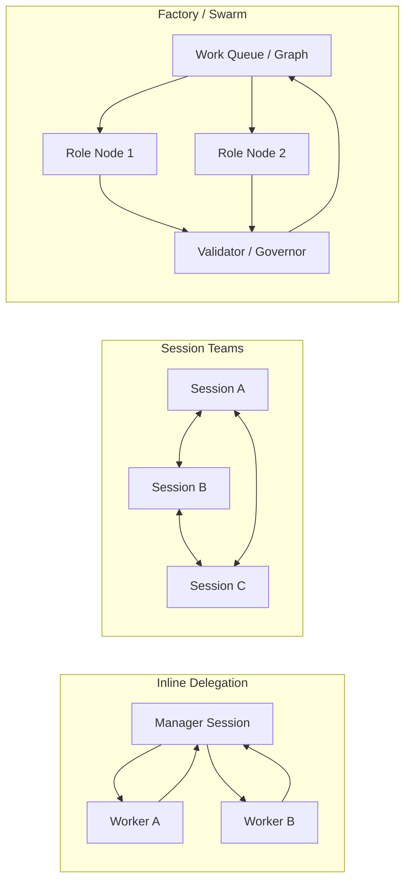

# Orchestration Topologies

## Definition
Orchestration topology is the shape of coordination inside a harness: who can spawn whom, who can talk to whom, and where the durable work state lives. The crucial question is not whether there are “multiple agents,” but what graph those agents inhabit.

## Topology sketch

## Inline delegation
One topology is inline delegation through subagents. Here the main session remains the manager, workers get their own context windows, and results flow back upward. Anthropic's subagent docs make this explicit: subagents are cheap, focused, and useful when the main agent only needs the answer, not an ongoing committee. This is the lightest-weight topology in the current corpus.

## Session teams
Another topology is a team of separate sessions that can communicate directly. Anthropic's [[claude-code]] agent teams and OpenAI's parallel Codex app workflows both move in this direction, though Claude documents the distinction more explicitly. This shape is useful when workers need to challenge findings, coordinate ownership, or operate on separate parts of a task without being funneled through one parent turn.

## Factory and swarm topologies
[[gas-town]] and [[gas-city]] take the idea further by making coordination itself the main architecture: mayors, polecats, sheriffs, beads, convoys, and federation protocols. Here the topology is not an implementation detail; it is the product.

## Design lesson
Topology should follow dependency structure. If the work is mostly independent and the manager only needs summarized results, inline delegation is enough. If workers need live back-and-forth, separate-session teams make more sense. If the system needs routing, governance, and durable throughput across many tasks, swarm or factory structures may be justified. Choosing a heavier topology too early is one of the easiest ways to industrialize confusion. The more formal version of this claim is developed in [[partial-order-trace-semantics]]: topology is really a statement about dependency order, concurrency, and branching, not just a social diagram of agent roles.

Topology is also not the whole story. Two systems can share the same graph shape while using very different coordination rules inside that graph: bidding, blackboard contribution, coalition formation, or quorum. That protocol layer is what [[non-hierarchical-coordination-patterns]] is meant to surface. A tree of sessions can still behave non-hierarchically if task claiming, coalition memory, and commit rules are distributed. The strongest current example of that distinction in this wiki is [[fission-fusion-orchestration]].

Recent LLM MAS papers sharpen two more distinctions. First, topology is not the same thing as model assignment: X-MAS shows that different nodes in the same visible graph may need different underlying models if the goal is to exploit heterogeneous strengths rather than clone one model into many costumes. Second, topology is not the same thing as schedule: DynTaskMAS treats the live task graph and asynchronous dependency management as the operative coordination object, which is closer to a dynamic workflow runtime than to a fixed org chart.

## Related pages
Read this with [[agent-harness-anatomy]], [[work-management-primitives]], [[automation-and-background-work]], [[non-hierarchical-coordination-patterns]], [[fission-fusion-orchestration]], [[claude-code]], [[gas-town]], and [[harness-architecture-comparison]].
