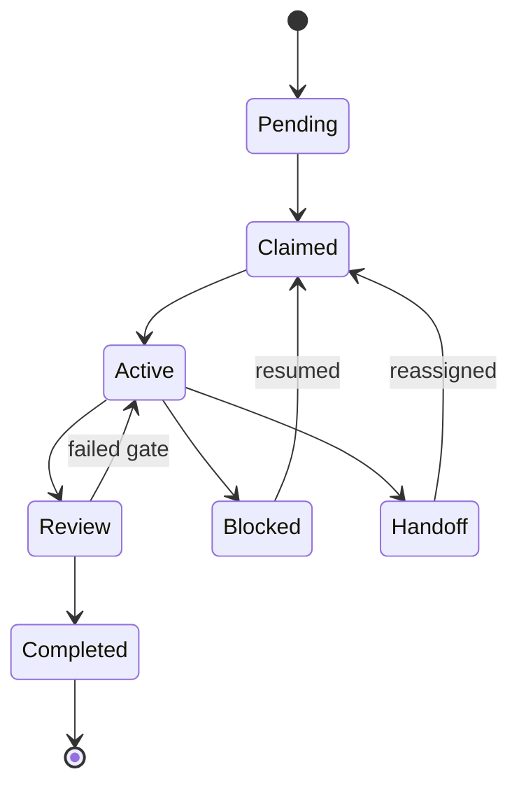

# Work Management Primitives

## Definition
Work-management primitives are the concrete objects through which an agent harness represents pending, active, reviewed, and completed work. Good primitives make retries and handoffs routine. Bad ones turn every resumption into archaeology.

## Generic lifecycle

## Gas Town family
The richest vocabulary in the source set comes from [[gas-town]]: beads, epics, molecules, protomolecules, formulas, and wisps. These objects encode hierarchy, workflow composition, and persistence. Gas City then generalizes them into a more modular coordination kit.

## Anthropic family
Anthropic's feature lists, init scripts, and progress logs are much simpler primitives, but simplicity is the point. A large JSON checklist with explicit pass/fail state avoids the soft deceit of freeform notes and gives later agents a recoverable truth source.

## Operational lesson
The right primitive is the one that survives interruption and guides the next action. In that respect, a dull `feature_list.json` can beat a flamboyant swarm if the former actually causes the next session to test the right thing. The same logic applies when work becomes scheduled or unattended: the primitive still needs a clear owner, cadence, and review destination, which is where [[automation-and-background-work]] enters the picture. The next formal question is whether these primitives should be modeled as serial lists at all, or as the richer dependency objects discussed in [[partial-order-trace-semantics]].

## Related pages
Work primitives are where [[memory-persistence]] meets orchestration. See [[automation-and-background-work]], [[gas-town]], [[gas-city]], and [[claude-code]], then compare approaches in [[harness-architecture-comparison]].
