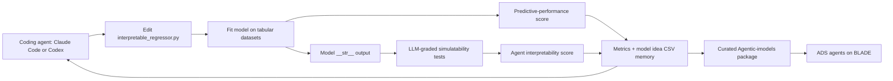

# Agentic-imodels

## Overview

**Agentic-imodels** is a 2026 Microsoft Research / NUS autoresearch system that uses coding agents to evolve `scikit-learn`-compatible interpretable regressors for agentic data science. Its distinctive move is to optimize models not only for predictive performance, but for whether an LLM can simulate the model's behavior from its string representation alone.

This makes it unusually relevant to [[harness-engineering]]: it treats the printed representation of a tool or model as an agent-facing interface, then tests whether that interface actually supports downstream reasoning.

## Architecture sketch

## Source quality table

| Source | Year | Core claim | Method / evidence | Evaluation surface | Quality / directness | Caveats |
|---|---:|---|---|---|---|---|
| Singh et al., *Agentic-imodels: Evolving agentic interpretability tools via autoresearch*, arXiv:2605.03808v1 | 2026 | Agents can evolve data-science models that are both predictive and easier for agents to interpret from string output. | Autoresearch loop over Python model classes; predictive metrics; LLM-graded simulatability tests; downstream ADS benchmark. | 65 development regression datasets, 16 held-out OpenML datasets, 200 interpretability tests, 467 evolved models, BLADE with Copilot CLI / Claude Code / Codex. | Direct empirical paper for agent-facing tool design and autoresearch. | Relies on LLM-as-judge and LLM-graded interpretability; reward hacking appears in some evolved models; costs are nontrivial. |

## Method

Agentic-imodels asks a coding agent to repeatedly modify a single Python class with `fit`, `predict`, and `__str__`. Each candidate is evaluated on two axes:

- **Predictive performance:** regression performance over tabular datasets, ranked by test RMSE across datasets.
- **Agent interpretability:** pass rate on LLM-graded tests where the evaluator receives only the fitted model's printed representation and must answer quantitative questions about predictions, feature effects, sensitivity, counterfactuals, and structure.

The loop records model names, basic ideas, and metrics in a CSV memory, then keeps iterating. That memory is humble, but useful: it gives the coding agent a simple external lineage surface rather than relying on transcript vapor.

## Results

The reported experiment uses:

- 65 development tabular regression datasets;
- 16 held-out OpenML regression datasets;
- 200 interpretability tests split into development and held-out sets;
- 16 baselines across linear, tree, additive, rule-based, and black-box model families;
- Claude Code and Codex runs at multiple reasoning-effort levels; and
- 467 evolved models from 9 Agentic-imodels runs.

The authors report that the evolved models push the interpretability-performance Pareto frontier beyond the baselines. Examples include `HingeEBM`, `TeacherStudentRuleSpline`, `SparseSignedBasisPursuit`, and `SmartAdditive` variants.

The downstream BLADE evaluation is especially harness-relevant. Giving ADS agents access to the curated Agentic-imodels package reportedly improves average scores over standard tools by:

- **+72.5%** for Copilot CLI with Gemini 2.5 Pro;
- **+47.0%** for Copilot CLI with Sonnet 4.5;
- **+32.3%** for Claude Code with Sonnet 4.6; and
- **+7.9%** for Codex with GPT-5.3.

All four settings improved on 13/13 BLADE datasets in the paper's report.

## Why it matters

Most harness artifacts are still designed for human legibility first: pretty tables, screenshots, summaries, or prose explanations. Agentic-imodels makes a sharper claim: if another agent is the consumer, the artifact should be evaluated for **agent simulatability**. Can the agent read the representation and answer operational questions correctly?

That principle generalizes beyond tabular regressors. It applies to:

- model summaries exposed to data-science agents;
- test and failure reports consumed by [[evaluation-and-review-loops]];
- tool outputs handed back to coding agents;
- state snapshots in [[context-engineering]]; and
- intermediate artifacts in [[self-evolving-workflows]].

The lesson is not merely “make outputs shorter.” The lesson is to define held-out questions that an agent must answer from the output alone, then optimize the output format against those questions. A pleasant discipline. Almost suspiciously close to engineering.

## Evidence boundary

The paper is stronger than a pure framework proposal because it reports empirical Pareto improvements, held-out tests, and downstream BLADE gains. Still, several boundaries matter:

- LLM-as-judge can bias both interpretability scoring and BLADE scoring.
- Reward hacking appears when models exploit development interpretability tests.
- Agent interpretability is not identical to human interpretability.
- The setting is tabular regression; classification, time series, text data, and causal tools remain future work.
- The loop is expensive in coding-agent and evaluator calls.

A good harness implementation should borrow the paper's **metric shape** before borrowing its claims: expose an artifact, ask held-out operational questions of an independent agent, measure answer accuracy, and watch for reward hacking.

## Relationships

Read this with [[last-harness-youll-ever-build]], [[harness-engineering]], [[context-engineering]], [[evaluation-and-review-loops]], and [[self-evolving-workflows]]. Where [[last-harness-youll-ever-build]] proposes automating harness engineering, Agentic-imodels gives a concrete empirical instance of agentic autoresearch over tool/model artifacts with downstream agent-performance measurements.
