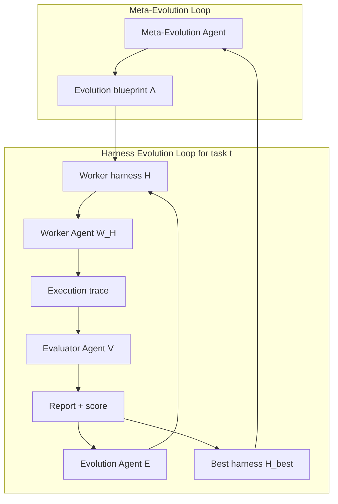

# The Last Harness You'll Ever Build

## Overview

*The Last Harness You'll Ever Build* is a 2026 Sylph.AI framework paper that proposes automating [[harness-engineering]] itself. Its core claim is a two-level loop:

1. an inner **Harness Evolution Loop** that iteratively improves a worker agent's harness for one task; and
2. an outer **Meta-Evolution Loop** that improves the blueprint used to run that inner loop across many tasks.

The useful contribution for this wiki is not empirical proof; the paper is explicit that empirical results are future work. Its value is a clean vocabulary for treating prompts, tools, traces, evaluators, orchestration logic, and model routing as mutable harness artifacts under an evaluator-governed optimization loop.

## Architecture sketch

## Source quality table

| Source | Year | Core claim | Method / evidence | Evaluation surface | Quality / directness | Caveats |
|---|---:|---|---|---|---|---|
| Seong, Yin, Zhang, Shi, *The Last Harness You'll Ever Build*, arXiv:2604.21003v3 | 2026 | Harness engineering can be automated by an evaluator-driven inner evolution loop plus a meta-evolution loop over the loop blueprint. | Formal framework, algorithms, architecture diagram, and meta-learning analogy. | Proposed metrics: convergence speed, final performance, robustness on held-out tasks. | Directly relevant framework paper for agent harness design. | No empirical results in the version read; product/evaluation claims are prospective. |

## Inner loop: harness evolution

The inner loop optimizes a worker harness for a fixed task. It assumes:

- a task with instructions and verifiable success criteria;
- a worker agent parameterized by a harness;
- an adversarial evaluator that checks state, success criteria, performance, and regressions; and
- an evolution agent that edits the harness based on all prior attempts.

This is close to [[self-evolving-workflows]], but the evolution surface is broader than a workflow graph or prompt. The paper explicitly includes tools, skills, infrastructure, observation structure, orchestration rules, hooks, middleware, and model configuration. That makes the loop a harness-level optimizer rather than another prompt optimizer wearing a hat.

## Outer loop: meta-evolution

The outer loop treats the inner-loop blueprint itself as a harness. The blueprint includes the worker, initial harness, evaluator, evolution agent, scoring function, observations, iteration budget, parallelism, revert thresholds, and stopping criteria. A meta-evolution agent then searches for blueprints that make inner-loop harness convergence faster and more robust across task families.

This places the paper near [[prompt-optimizer-regimes-for-harnesses]] and [[arxiv-self-evolving-workflows-for-codex-control-plane]], but with the object of optimization lifted from task prompt or workflow graph to the whole harness-improvement process.

## Why it matters

For [[harness-engineering]], the paper sharpens a useful distinction:

- **Manual harness engineering:** humans design prompts, tools, traces, evaluators, and orchestration for each new domain.
- **Automated harness engineering:** agents modify those harness artifacts in response to task traces and evaluator feedback.
- **Meta-automated harness engineering:** another loop learns which evaluation/evolution blueprint adapts fastest to new domains.

That third tier is the interesting one. It says the design of the improvement loop is itself a first-class optimization target, not merely an implementation detail.

## Evidence boundary

The paper should be treated as a high-signal framework proposal, not as a validated benchmark result. It contributes terms, loop structure, and an optimization framing. It does not yet show that the loop works across the complex enterprise workflows it names. Any implementation derived from it should therefore use a falsifiable gate such as:

- convergence speed improves over a manually designed baseline on held-out task families;
- final pass rate improves after a fixed inner-loop budget;
- regressions are detected and reverted reliably; and
- the meta-learned blueprint transfers to tasks not seen during meta-training.

Without those gates, the outer loop can become an elegant machine for generating increasingly confident harness folklore. We have enough folklore; it has not been running tests.

## Relationships

Read this with [[harness-engineering]], [[self-evolving-workflows]], [[evaluation-and-review-loops]], [[context-engineering]], and [[work-management-primitives]]. It is also a natural neighbor of [[gepa|GEPA]], [[judgeflow|JudgeFlow]], and [[memento-skills]] because all three turn traces or evaluation feedback into durable improvements rather than one-off conversational advice.
