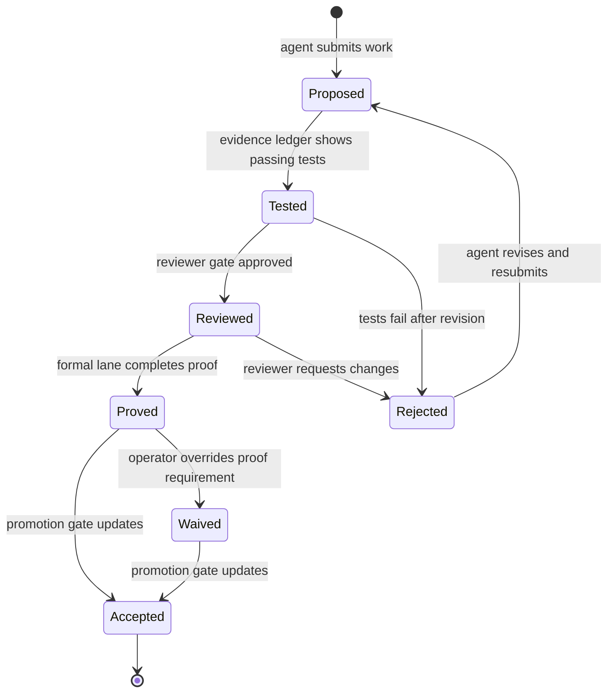

# Agent-Facing Verifier and Testing Harness Architecture

## Question
If a harness treats verifiers, tests, proofs, traces, and reviewer gates as first-class environment objects, what is the minimum object model, state machine, and primitive set that makes them usable by an agent rather than merely visible to a human operator?

## Short answer
The model is not merely "APIs over pytest." It is a structured evidence surface with specification objects, evidence ledgers, promotion gates, and regression memory, coupled to a state machine that separates builder, verifier, and reviewer roles without flattening them into one actor.

## What the evidence says

### From the harness survey literature
The modern harness survey frames an agent harness as six governance functions: **Execution (E), Tool Registry (T), Context (C), State Store (S), Lifecycle Hooks (L), Evaluation Interface (V).** The critical additions for verification are **S** and **V** when they are treated as structured objects rather than atmospheric logging. The state store `S` is where evidence survives, and the evaluation interface `V` is where evidence becomes legible enough to drive further action.

### From CodeTracer
[[code-tracer-towards-traceable-agent-states|CodeTracer]] shows that raw agent run directories are insufficient. Heterogeneous traces must be normalized into typed records (action, observation, diff, verification) and then indexed into a **hierarchical trace tree** with exploration nodes and state-changing nodes. The important step for harness design is that failure-onset localization is not a human convenience; it is a structured signal that can be fed back into the agent as a **reflective replay** prefix, recovering failed runs deterministically under the same budget.

### From another-harness
The local prototypes in [[another-harness-work-item-closure-environment]] and [[another-harness-evaluator-discipline-environment]] validate a narrower but real version of the same idea: the environment is not a test runner but a **frozen contract with role-specific permissions.** Builder episodes may not approve completion. Evaluator episodes may not rewrite deliverables. This is the verifier-as-environment-object in concrete form.

### From SWE-Gym and AppWorld
[[swe-gym]] pairs builder training with verifier training on the same trajectory substrate. [[app-world]] uses state-based evaluation with collateral-damage checks. The lesson is that the environment must reward not only the final artifact but the trace of interaction that produced it, and that verifier interaction traces are themselves learnable.

---

## Candidate primitives

### 1. Specification surface
A first-class specification object that narrows natural-language intent into something checkable.

| Kind | Granularity | Example |
|---|---|---|
| Assertion | Line/function | `assert_equals(out, expected)` |
| Contract | Module boundary | Pre/post conditions, type invariants |
| Property | System behavior | `forall lists l: reverse(reverse(l)) == l` |
| Temporal property | Multi-step trace | `eventually(always(reconciled))` |
| Theorem statement | Formal claim | `∑ n i=1 i = n(n+1)/2` |
| Reviewer checklist | Human gate | Acceptance artifact with pass/fail items |

The harness does not require all of these at once. It requires that whatever kind is chosen, the specification object is **addressable, versioned, and referenced by evidence records**, not buried in prose.

### 2. Evidence ledger
A durable append-only record of what was run, against what specification, in what environment, producing what result.

```
evidence_record:
  record_id: sha256(content)
  spec_ref: {kind, address, version}
  run_context: {command, env_hash, agent_turn}
  result: {status, counterexample, diff, log_ref}
  artifact_hash: sha256(files_at_time)
  reviewer_decision: {pending | accepted | rejected | waived}
  limitation: optional
  timestamp: iso8601
```

This is the harness-level equivalent of what [[swe-gym]] and [[app-world]] do inside their evaluators, but lifted into a reusable ledger so that evidence survives beyond one benchmark run.

### 3. Promotion gate
A state object that tracks where a piece of work sits in the acceptance pipeline.

```
promotion_state:
  artifact_ref: {path, commit, version}
  tests: {passed, failed, skipped, record_refs}
  proofs: {proved, pending, counterexample, record_refs}
  reviews: {open, approved, changes_requested, dismissed}
  regression_checks: {all_passing, known_failures, record_refs}
  overall: {proposed | tested | reviewed | proved | rejected | waived}
```

A promotion gate is not a CI badge. It is a structured state machine with computed fields so that an agent can query it, reason about it, and act on blocked transitions.

### 4. Regression memory
Prior failures and counterexamples promoted into reusable specification objects.

```
regression_item:
  spec_ref: {address, version}  # the test or property that failed
  counterexample: {input, trace_ref}
  first_seen: timestamp
  last_reproduced: timestamp
  status: {open | fixed | accepted | regression_detected}
  linked_spec_refs: [...]  # other specs that this failure validates
```

This is adjacent to [[memory-persistence]] but scoped to evidence rather than general context. It answers the question: "if this worked before, why should I believe it works now?"

### 5. Trace tree node
A normalized node in the hierarchical trace model suggested by CodeTracer.

```
trace_node:
  node_id: uuid
  kind: exploration | state_change | verification | rollback
  action: {tool_call, raw_command}
  observation: {stdout, stderr, dom, screenshot, return_value}
  diff: {files_changed, patch_ref}
  verification: {spec_ref, evidence_record_ref, pass|fail|unknown}
  children: [trace_node_refs]
  parent: trace_node_ref | null
  failure_onset: bool  # true if this is the earliest error-critical step
```

The trace tree survives one run and becomes navigable for replay or diagnosis.

---

## Proposed object model

```
Environment
├── specification_library
│   ├── assertions[]
│   ├── contracts[]
│   ├── properties[]
│   ├── theorems[]
│   └── reviewer_checklists[]
├── evidence_ledger
│   └── evidence_records[]
├── promotion_gates
│   └── promotion_states[]
├── regression_memory
│   └── regression_items[]
└── trace_forest
    └── trace_trees[]
        └── trace_nodes[]
```

Every top-level object is versioned and hash-addressed. The ledger and regression memory are append-only. The promotion gates are mutable state machines with versioned transitions. The trace forest is a write-once, read-many index of historical runs.

---

## State machine: the promotion pipeline



Important invariants:
- A builder may not transition its own promotion gate beyond **Proposed**.
- An evaluator may not transition a gate beyond **Tested**; only a reviewer or formal verifier may advance further.
- A waiver is logged as an `evidence_record` with a limitation statement so that later audit trails can reason about it.
- Rejection returns to **Proposed**, not to a generic "failed" sink, so the state machine preserves retry context.

---

## How this relates to existing harness components

| Harness component | Verifier-environment mapping |
|---|---|
| [[agent-harness-anatomy|Session container]] | Promotion gate owns session-scoped evidence |
| [[agent-harness-anatomy|Prompt assembly]] | Specification objects feed into context engineering |
| [[agent-harness-anatomy|Tool execution]] | Evidence records instrument tool calls |
| [[agent-harness-anatomy|Durable memory]] | Evidence ledger and regression memory |
| [[agent-harness-anatomy|Validation / Evaluators]] | Promotion gates with evaluator-discipline rules |
| [[agent-harness-anatomy|Handoff / Resume]] | Trace trees preserve state across interruptions |
| [[work-management-primitives|Work objects]] | Promotion gates become the canonical work state |
| [[evaluation-and-review-loops|Review loops]] | Structured reviewer gates with recorded decisions |
| [[formal-methods-for-agent-harnesses|Formal lanes]] | Specification surfaces and proof-checked transitions |
| [[self-evolving-workflows|Evolution]] | Regression memory informs learned test selection |

---

## Open design questions

1. **Specification authoring authority.** Who may add a specification object? The agent, the operator, a separate requirements agent, or an inferred specification mined from trajectories? Each choice changes the trust model.

2. **Trace tree granularity versus compression.** CodeTracer demonstrates full tree indexing, but at scale this may exceed context-window or storage budgets. How should a harness summarize trace trees without losing the failure-onset signal?

3. **Formal lane integration depth.** Should the harness treat a theorem prover as just another tool in the evidence ledger, or as a privileged transition in the promotion gate? The latter is cleaner but harder to generalize across tools.

4. **Anti-gaming at the evidence level.** If evidence records are durable and hash-addressed, an agent could replay old successful evidence to mask a regression. The ledger needs freshness checks, environment hash binding, and possibly adversarial re-run sampling — similar to the hardening already done in [[another-harness-evaluator-discipline-environment]].

5. **Waiver semantics and governance.** A waiver is a decision to accept without evidence. It must be explicit, attributed, and reversible. But it also opens an attack surface: an agent that learns to petition for waivers instead of producing evidence. How should waiver patterns be detected and surfaced?

6. **Regression item decay.** Not all historical failures deserve permanent memory. Some were fixed, some were accepted as expected behavior, and some were symptoms of transient environment drift. The regression memory needs a principled eviction or demotion policy rather than unbounded accumulation.

---

## Bottom line
The agent-facing verifier environment is not a bag of testing tools. It is a **structured substrate** for specifications, evidence, promotion, and regression, governed by a state machine that enforces role separation between builder, tester, reviewer, and formal verifier. The primitives are not exotic: ledgers, state machines, trees, and hashes. What matters is that they are exposed as addressable objects rather than hidden inside CI logs or human dashboards.

The closest existing precedent is the combination of [[swe-gym]] (trajectory + verifier training), [[app-world]] (state-based grading), [[another-harness-work-item-closure-environment]] (frozen contract + role isolation), and [[code-tracer-towards-traceable-agent-states|CodeTracer]] (hierarchical trace indexing). The proposed architecture unifies these into a single object model that a harness can query, inspect, and learn from.

## Related pages
Read this with [[software-verification-testing-environment-research-program]], [[formal-methods-for-agent-harnesses]], [[evaluation-and-review-loops]], [[work-management-primitives]], [[agent-harness-anatomy]], [[self-evolving-workflows]], [[another-harness-work-item-closure-environment]], [[another-harness-evaluator-discipline-environment]], [[swe-gym]], [[app-world]], [[code-tracer-towards-traceable-agent-states]].
