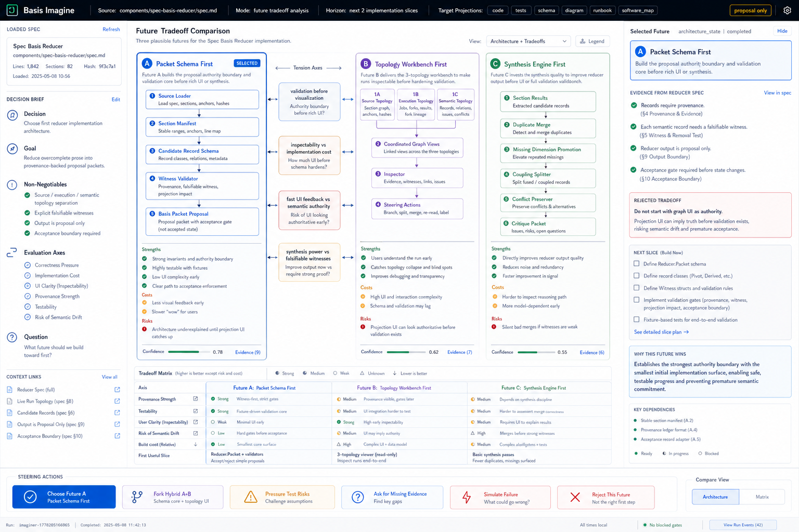
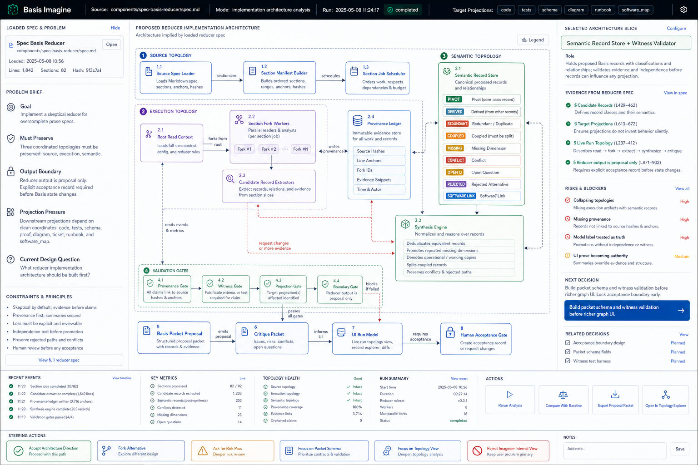

# Basis Imagine Workbench



_Recovered from the Codex generated-image corpus. It is a screenshot-like UI artifact/design record, not accepted Basis state and not proof that the live runtime produced these exact pixels._

## Question

What is Basis.Imagine, what work exists in the Codex worktree, and how does it relate to Basis.Reduce?

## Short answer

Basis.Imagine is the plan-space search side of Basis. It asks what implementation future should be built next for a source spec and repository snapshot. The current worktree shows a separate `ui/imaginer.html` surface, app-server-backed lens orchestration, architecture-state projection, future-tradeoff comparison, and human steering actions.

Its correct posture is proposal-only. The imaginer may compare futures and expose consequences, but it does not accept an implementation plan for the user. The seat of judgment remains outside the machine. A small mercy, but a necessary one.

## Current evidence

| Item | Evidence | Public-safe reading |
|---|---|---|
| Worktree | `/Users/ericfode/.codex/worktrees/95ae/basis` | registered Codex worktree for starting/iterating the imaginer |
| Branch | `codex/start-imaginer` | imaginer branch based on root `a5544e0` |
| Dirty state | 13 modified tracked files, 3 untracked files | active worktree, not ready to present as canonical |
| New UI files | `components/spec-basis-reducer/ui/imaginer.html`, `future-tradeoffs.js` | separate imaginer URL and future-analysis model |
| Runtime files | `lib/basis/run/server.ex`, `lib/basis/llm/*`, `lib/basis/web/server.ex` | live run server, app-server provider, lens specs, scripted fixtures |
| Gates observed | `mise exec -- mix test`; `node --check future-tradeoffs.js && node --check app.js` | mix tests passed; JS syntax checks passed |

The Codex log shows an owned runtime entrypoint:

```text
mise exec -- mix basis.server --port 8767
```

It also records the user asking to move the imaginer URL to:

```text
/ui/imaginer.html
```

That split is important. Basis.Reduce and Basis.Imagine should be related surfaces, not the same screen wearing different hats.

## What changed recently

Recovered updates from the worktree and logs:

- `ui/imaginer.html` was added as a dedicated imaginer entrypoint.
- `future-tradeoffs.js` was added to build a live/fallback future-tradeoff model.
- The UI now compares at least three futures:
  - **Packet Schema First** — build proposal authority and validation before richer UI/synthesis;
  - **Topology Workbench First** — build the inspectable topology workbench early;
  - **Synthesis Engine First** — improve reducer output quality through synthesis/de-duplication first.
- Tradeoff axes include provenance, testability, user clarity, semantic-drift risk, build cost, and first useful slice.
- Runtime actions include synthesis requests, search steering, branch queueing, branch focus, and path rejection.
- App-server/provider handling and scripted/fake provider tests were expanded so live jobs and fixtures can share a boundary.
- The architecture-state projection shows source topology, execution topology, semantic topology, validation gates, proposal packets, critique packets, UI run model, and the human acceptance gate.



## Live-run evidence from the logs

One recovered Codex run started the imaginer through the local server with:

```text
run_id: imaginer-1778199448840
mode: imaginer
provider: AppServerProvider
source: components/implementation-imaginer/spec.md
target: implementation_plan
branch_count: 3
max_depth: 4
initial active Codex turns: 2
initial event count: 344
```

This is enough to say the imaginer was not merely a static mock. It had a live server path and app-server jobs. It is **not** enough to say the resulting futures are accepted project direction.

## The main design result

The strongest recovered recommendation is **Packet Schema First**:

> build the proposal authority boundary and validation core before rich UI or synthesis.

That recommendation matters because it applies the Basis discipline back onto Basis itself. If the imaginer UI gets too good before packet/validation authority is real, it can make speculation look like knowledge. The workbench notices that risk; this is exactly the kind of self-suspicion a planning tool should have.

## What Basis.Imagine is allowed to claim now

Observed evidence supports these claims:

1. Basis.Imagine has a separate UI route and active worktree.
2. It can be started through the local Basis server and app-server provider.
3. It has a future-tradeoff comparison model with named futures and axes.
4. It has runtime hooks for steering, synthesis, and branch/path actions.
5. Its recovered UI artifacts consistently mark the state as proposal-only.

It does **not** yet support these claims:

- that the dirty worktree should be merged as-is;
- that future rankings are empirical proof;
- that the imaginer can replace human architectural judgment;
- that generated screenshot-like artifacts are runtime evidence by themselves;
- that Basis.Imagine has proved utility in the pathology study.

## Relationship to Basis.Reduce

[[basis-reduce-workbench]] asks what the source spec actually supports and where projection targets would invent semantics. Basis.Imagine asks which implementation future should be explored under those constraints.

The clean combined loop is:

```text
Basis.Reduce
  source-backed proposed records, gaps, conflicts, target impacts
        │
        ▼
Basis.Imagine
  proposal-only futures, tradeoffs, architecture slices, validation risks
        │
        ▼
human acceptance gate
  choose, reject, fork, or demand evidence
```

If Reduce fails, Imagine hallucinates policy. If Imagine fails, Reduce becomes a beautiful filing cabinet. Neither failure mode is especially noble.

## Recommended next slice

1. Stabilize the dirty `codex/start-imaginer` worktree into a reviewable patch or consciously archive the spike.
2. Keep `Packet Schema First` as the default next future unless new evidence beats it.
3. Add fixtures that show future rankings change when the source spec changes in targeted ways.
4. Connect the imaginer to the `spec-pathology-study` competence-floor gates before using its proposals as builder interventions.
5. Keep future-tradeoff UI visibly proposal-only and link every recommendation back to source evidence or explicit absence.

## Related pages

- [[basis-project-index]] — the Basis project corner.
- [[basis-reduce-workbench]] — source-review and pathology-study counterpart.
- [[basis-architecture-and-plans]] — broader architecture and implementation plan.
- [[basis-source-basis-and-safety-gate]] — what may be published from Codex logs and local worktrees.
