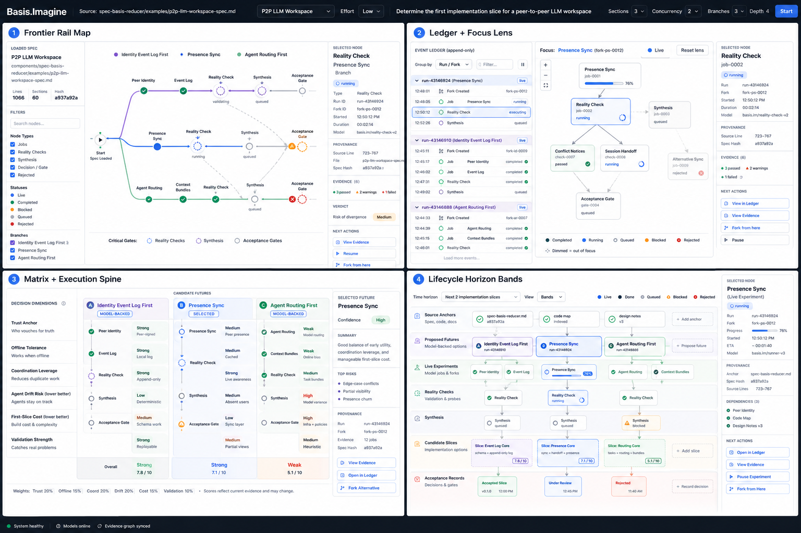
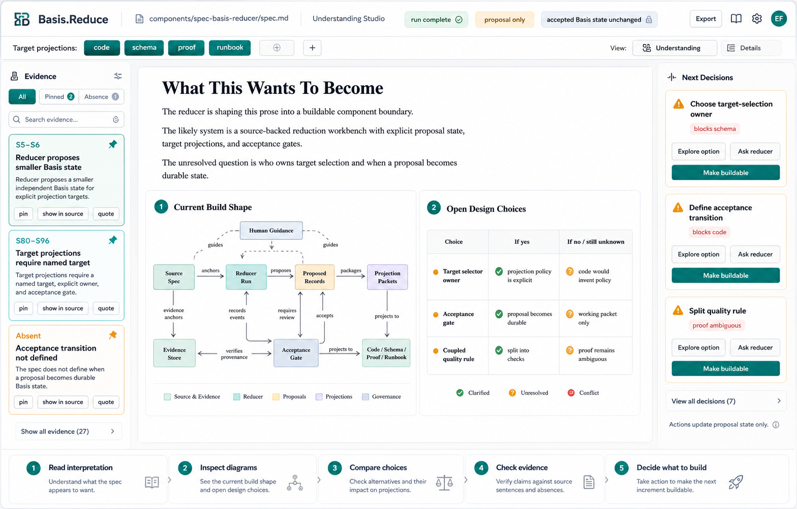

# Basis Reduce Workbench

_Recovered from the Codex generated-image corpus. Treat it as a screenshot-like UI artifact/design record unless a later browser-capture path proves literal runtime provenance. The distinction is load-bearing; beautiful screenshots are still not evidence by themselves._

## Question

What is Basis.Reduce, what recent work exists in the Codex worktree, and what should the wiki say about it without leaking private run state?

## Short answer

Basis.Reduce is now best understood as a source-review and proposal-state workbench. It is not merely a function that compresses Markdown. The current worktree shows a UI and runtime organized around source sentences, semantic lanes, pinned evidence, projection-impact checks, explicit review actions, and an acceptance/decision inspector.

Its strongest current research lane is the spec-pathology study: a set of HTML/JS experiment surfaces meant to test whether reducer packets and imaginer interventions actually improve implementation outcomes, process cost, and pathology recovery. That lane is promising because it refuses to count a pretty analysis packet as proof.

## Current evidence

| Item | Evidence | Public-safe reading |
|---|---|---|
| Worktree | `/Users/ericfode/.codex/worktrees/4e6b/basis` | registered Codex worktree for reducer inspection/evaluation |
| Branch | `codex/inspect-reducer-eval...origin/codex/inspect-reducer-eval` | tracked branch for reducer-review work |
| HEAD | `ceb8df8 Fix reducer feedback modal stacking` | recent reducer UI/control-plane polish is committed on the branch |
| Dirty state | untracked `components/spec-basis-reducer/experiments/spec-pathology-study/` | substantial experiment artifact tree exists but is not yet canonical |
| Control contract gate | `node components/spec-basis-reducer/ui/tests/validate-reducer-control-contract.mjs` | passed: 33 reducer buttons and 21 control bindings |

## What changed recently

Recent commits show a consistent direction:

- reducer feedback preview and concurrency were repaired;
- reducer reasoning-effort and projection actions were exposed more clearly;
- source-section pinning and build-shape recovery were added;
- record-review actions were clarified;
- sidebar decision cards became clickable choices;
- review actions were renamed toward git/review verbs rather than vague UI verbs;
- feedback modal stacking was fixed.

The recovered UI artifacts show two complementary surfaces:

- **Source Review Workbench**: sentence list, semantic lanes, pinned evidence, projection impact matrix, and acceptance/decision inspector.
- **Understanding Studio**: prose interpretation, build-shape diagram, open design choices, and next-decision cards.

The useful architectural point is that the UI keeps saying “proposal only.” That phrase should remain annoying and visible; it is the handrail preventing model output from becoming specification law by costume change.

## The reducer is testing itself now

The untracked `spec-pathology-study` tree is the important missing update. It contains:

- HTML experiment/spec pages for testing reducer and imaginer utility;
- a reward/progress dashboard (`reward.html`, `reward-state.json`);
- generated incomplete-spec and large-spec conditions;
- hidden evaluator artifacts and candidate implementations;
- score reports for reducer packets, incomplete waves, telemetry, and a large corrupted-spec wave.

Public-safe recovered results:

| Result | Meaning |
|---|---|
| precise reducer packet precision/recall/F1 = `1` in the packet score report | the packet can identify the targeted hidden failure buckets in that fixture |
| incomplete-spec wave has 11 conditions | the study now has more than “good spec vs bad spec”; it names omission families |
| telemetry harness ready with 18 fields | process cost is measured separately from final behavior |
| large wave complete with clean baseline score `0.0967741935483871` | the large task is currently below competence floor |
| large-wave synthesis rejects strong utility claims | correct caution: every assignment failed every hidden bucket, so deltas are not interpretable |

That last point is not failure as much as hygiene. A system that can say “this experiment does not yet support my favorite conclusion” is already ahead of most dashboard-shaped seduction devices.

## What Basis.Reduce is allowed to claim now

Observed evidence supports these claims:

1. Basis.Reduce has a meaningful review-workbench shape: source evidence, proposed records, target impacts, and decision actions are visibly separated.
2. The reducer branch has committed UI/control improvements and a passing button/control-binding contract gate.
3. The pathology-study lane has started measuring the right variables: behavior score, process cost, reducer prediction, intervention controls, and competence floors.
4. The current large-wave result is inconclusive for reducer/imaginer utility because the clean baseline failed too badly.

It does **not** yet support these claims:

- that Basis.Reduce improves real implementation quality in general;
- that a pretty packet should be trusted over the source;
- that generated UI state is accepted Basis state;
- that the untracked pathology-study tree is canonical project state.

## Recommended next slice

1. Decide whether `spec-pathology-study/` should be committed, pruned, or split into smaller tracked artifacts.
2. Preserve the reward-state and score reports, but keep raw generated candidate bodies private/public-reviewed.
3. Add a competence-floor gate before running more large-wave builder arms.
4. Treat precise reducer packets as an intervention arm only after clean-control builders can pass the locked evaluator.
5. Keep linking this page to [[basis-imagine-workbench]], because the core question is whether Reduce and Imagine together lower ambiguity, not whether either produces impressive prose alone.

## Related pages

- [[basis-project-index]] — the Basis corner and public-safe project rollup.
- [[basis-imagine-workbench]] — the paired plan-space/future-tradeoff workbench.
- [[basis-experiment-status]] — current gates and experiments.
- [[basis-source-basis-and-safety-gate]] — publication boundary for Codex logs, generated images, and private run state.
