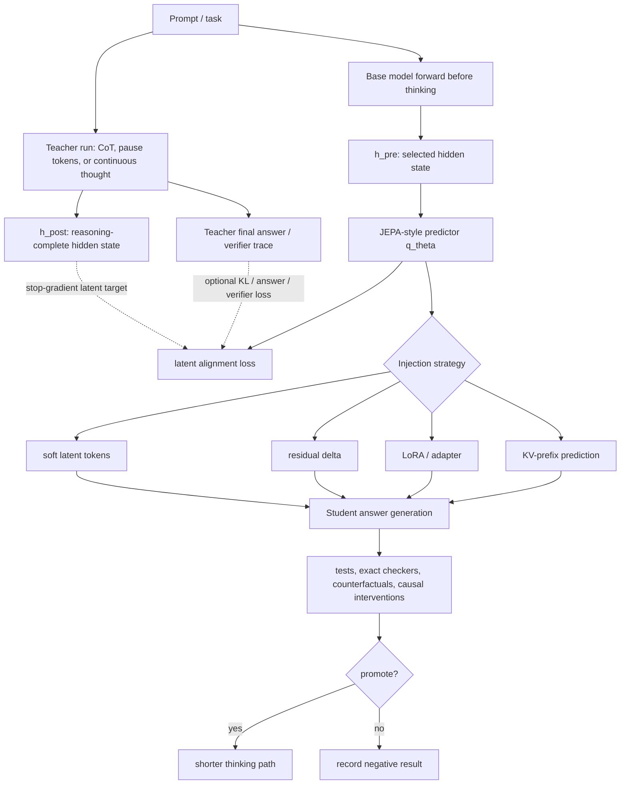

# Hidden-State JEPA for Reasoning Shortcuts

## Question

Can Gemma 4, or a similar open model, be trained with a JEPA-like self-supervised objective to map the model's embedded state before thinking finishes directly to the state after thinking, effectively skipping a visible or latent chain of thought?

## Short answer

Yes, **as a research experiment**. No, not as a trusted general reasoning replacement yet.

The credible version is an **amortized latent-reasoning predictor**:

1. run a teacher trace with visible, pause-token, or continuous latent thinking;
2. capture `h_pre` from the prompt-only or early-thinking forward pass;
3. capture `h_post` at a fixed reasoning-complete boundary;
4. train a small predictor, adapter, or LoRA surface so `q_theta(h_pre)` approximates `h_post` or a compressed post-thinking prefix;
5. inject the predicted latent back into the model;
6. accept the shortcut only when execution-based or counterfactual verification says it preserved the result.

The non-credible version is: “the early vector contains the answer if we stare at it hard enough.” That is not a theorem. It is barely even a coping strategy.

This answer should be read against [[neural-native-programming]], [[neural-native-programming-research-program]], [[on-policy-self-distillation]], and [[attention-and-attribution-views-for-llm-harnesses]]. The wiki’s existing position already applies: residual streams are plausible substrates, but dense latent states are not automatically languages, proofs, or explanations.

## Diagram



## Is Gemma 4 usable?

Yes. A direct Hugging Face API check on 2026-05-05 found public, non-disabled Google Gemma 4 model entries including `google/gemma-4-E2B-it`, `google/gemma-4-E4B-it`, `google/gemma-4-26B-A4B-it`, and `google/gemma-4-31B-it`. The observed tags include `gemma4` and `license:apache-2.0` in the retrieved model metadata.

For this particular experiment:

| Candidate | Use first? | Why |
|---|---:|---|
| `google/gemma-4-E2B-it` | yes | Smallest Gemma 4 candidate; best for frozen hidden-state extraction and predictor training. |
| `google/gemma-4-E4B-it` | yes | Better capacity while still plausibly local. |
| `google/gemma-4-26B-A4B-it` | no, not first | Candidate teacher/inference model, but too expensive for first hidden-state training. |
| `google/gemma-4-31B-it` | no, not first | Useful later if the method survives, not for early iteration. |
| `Qwen/Qwen3-4B` | strong alternative | Explicit reasoning-mode ecosystem may make pre/post boundary construction cleaner. |
| `DeepSeek-R1-Distill-Qwen-7B` | teacher candidate | Useful for generating reasoning traces; less clean for direct same-model hidden-state targets. |

Practical recommendation: start with **Gemma 4 E2B/E4B** if the goal is specifically Gemma-family work; otherwise start with **Qwen3-4B** or an R1-distill Qwen model to get cleaner thinking/no-thinking traces, then port the method back to Gemma.

## What exactly should be predicted?

Do **not** begin by predicting “the whole post-thinking state” as a vague object. Specify the target.

| Target | Difficulty | Why it may work | Why it may fail |
|---|---:|---|---|
| Final prompt-token hidden state after pause/latent thinking | low | Simple tensor target; JEPA-like loss is easy. | May be too little state to replace a whole reasoning trajectory. |
| State at a `<think_end>` / reasoning-complete boundary | medium | Cleaner semantic boundary if the trace format has one. | Boundary state may leak answer formatting or teacher artifacts. |
| k soft latent tokens | medium | Lets the model attend over a small compressed thought sequence. | Requires careful positional handling and training the model to consume soft tokens. |
| Residual delta at selected layer | medium-high | Directly tests internal write interfaces discussed in [[neural-native-programming]]. | Off-manifold deltas can destabilize generation. |
| LoRA/adapted student with hidden-state matching | high | Most likely to affect behavior robustly. | More expensive; risks learning answer shortcuts. |
| Synthetic KV-prefix approximating thought cache | very high | Closest to “skip the thought tokens.” | RoPE/cache shape and off-manifold cache errors make this a poor first experiment. |

The likely first useful artifact is not a single magic vector, but a **small latent prefix** or **adapter-conditioned state**.

## Paper evidence table

| Cluster | Sources | What they show | Quality / directness for this question | What they do not show |
|---|---|---|---|---|
| JEPA / latent feature prediction | I-JEPA (`arXiv:2301.08243`), V-JEPA (`arXiv:2404.08471`), CPC (`arXiv:1807.03748`) | Predicting future or masked latent representations can learn useful structure without reconstructing raw observations. | High source quality, low-to-medium directness. | They do not show that LLM reasoning-complete residual states can be reconstructed from early states. |
| Hidden compute before output | Pause Tokens (`arXiv:2310.02226`), Quiet-STaR (`arXiv:2403.09629`) | Extra hidden computation or generated rationales before answer can improve prediction/reasoning. | Medium-high quality, high conceptual relevance. | They spend additional steps; they do not skip them. |
| Continuous/latent reasoning | Coconut (`arXiv:2412.06769`) | LLMs can use hidden states as continuous latent thoughts rather than ordinary language tokens. | High relevance, emerging evidence. | It still performs sequential latent reasoning and relies on curriculum/traces; it is not one-shot pre→post jumping. |
| Reasoning distillation | STaR (`arXiv:2203.14465`), Distilling Step-by-Step (`arXiv:2305.02301`), Distilling System 2 into System 1 (`arXiv:2407.06023`) | Expensive reasoning traces or System-2 methods can be compiled into faster behavior. | High conceptual relevance; good quality. | Usually behavior/token distillation, not internal hidden-state JEPA. |
| Future-token / future-feature acceleration | EAGLE (`arXiv:2401.15077`), Medusa (`arXiv:2401.10774`), LayerSkip (`arXiv:2404.16710`), speculative decoding (`arXiv:2211.17192`, `arXiv:2302.01318`) | Current hidden states can draft future tokens/features and speed decoding when verified. | EAGLE is the closest engineering analogue. | These systems keep verification; they target short-horizon decoding, not long-horizon reasoning replacement. |
| Adaptive compute | CALM (`arXiv:2207.07061`), Mixture-of-Depths (`arXiv:2404.02258`), Universal Transformers (`arXiv:1807.03819`), PonderNet (`arXiv:2107.05407`) | Models can learn when less or more computation is needed. | Useful architectural precedent. | Compute gating is not equivalent to predicting a reasoning-complete latent state. |

## Why the idea is plausible

Three ingredients already exist:

1. **LLMs have useful internal states.** The [[neural-native-programming]] notes already treat the residual stream as a plausible read/write substrate, while warning that it is entangled.
2. **Self-supervised target creation is cheap.** Generate traces from the same model or a teacher, then extract `h_pre` and `h_post` from forward passes.
3. **Adjacent acceleration systems work when verified.** EAGLE, Medusa, LayerSkip, and speculative decoding all show that approximate future-state or future-token predictors can be useful when the target model or another verifier corrects them.

That makes the idea worth trying.

## Why it will not be a free lunch

The central limitation is informational, not aesthetic. If `h_pre` does not contain enough information to determine the correct reasoning branch, the predictor must either:

- perform the missing reasoning itself;
- guess from task priors;
- memorize benchmark patterns;
- or fail.

In other words, a shortcut model can amortize repeated reasoning patterns, but it cannot skip irreducible computation. One does not abolish search by renaming it “projection.”

A second issue: after a long chain of thought, the model does not merely have one final vector. It has a **KV cache over all thought tokens or latent steps**. Replacing that cache with a single state may work on narrow tasks, but it is unlikely to preserve general reasoning unless the base model has been trained to consume that compressed state.

## Recommended first experiment

### Phase 0: freeze the target

- Model: `google/gemma-4-E2B-it` or `google/gemma-4-E4B-it`; alternative `Qwen/Qwen3-4B`.
- Tasks: synthetic arithmetic/logic plus MBPP or HumanEval micro-slices.
- Trace format: explicit `<think> ... </think>` or pause-token/latent-token boundary.
- Hidden site: choose one layer and one boundary token; log exact layer, token position, dtype, and tokenizer.

### Phase 1: diagnostic JEPA predictor

Train a small predictor with the base model frozen:

```text
q_theta(h_pre) ≈ stopgrad(project(h_post))
```

Use cosine/MSE plus anti-collapse regularization. Measure hidden-state similarity, nearest-neighbor retrieval, and whether the predicted state clusters by the correct intermediate variables.

Promotion gate: continue only if predicted states retrieve the correct post-state family and are stable under paraphrase/variable renaming.

### Phase 2: injection ablation

Compare:

1. no shortcut baseline;
2. direct answer without thinking;
3. explicit thinking;
4. predicted soft latent tokens;
5. predicted residual delta;
6. LoRA/adapted student with hidden-state matching.

Primary metric is not cosine distance. Primary metric is verified correctness at matched compute.

### Phase 3: causal and adversarial tests

Use tasks with known intermediate variables: carries, DFA states, graph frontiers, sorted lists, proof states, or small program traces.

Require:

- counterfactual premise edits change the answer;
- nuisance edits do not;
- intervention on the predicted latent changes output in the expected direction;
- shortcut beats direct-answer and answer-only distillation baselines;
- OOD performance does not collapse with reasoning length.

## No-go criteria

Stop claiming “reasoning compression” if any of these hold:

- the shortcut does not beat direct answer distillation;
- gains vanish on counterfactual or execution-verified tasks;
- a shallow lexical/format baseline is competitive;
- hidden-state train/inference distributions are easily separable;
- answer information is leaked into the target state after the answer has already appeared;
- latent intervention tests do not causally affect the answer;
- predicted states are off-manifold and require fragile injection scales;
- safety or policy checks cannot inspect the latent artifact.

## Verdict

Use Gemma 4, Qwen3, or another open model to test it, but frame the experiment correctly:

> **Can we learn a verified latent shortcut that amortizes some reasoning traces on a bounded task family?**

That is plausible and worth building.

Do not frame it as:

> **Can we map pre-thinking directly to post-thinking and thereby bypass reasoning in general?**

That is currently unsupported. The literature gives you ingredients and analogies, not a license to skip the verification harness. The right research shape is a small, kill-happy program with a diagram, a source table, a verifier, and a readiness to write down a negative result if the beautiful machine refuses to become true.
