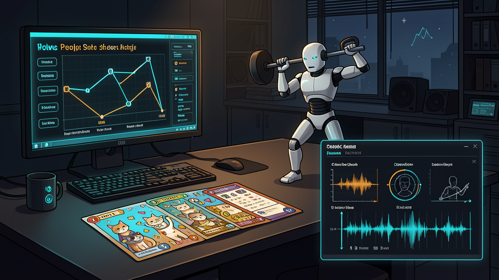

# Nightly Src Projects Desk (2026-04-21)

_Editorial illustration based on repo state rather than literal screenshots. It is meant to convey the current mix of work, not to impersonate a UI faithfully. One must keep standards somewhere._

## Verdict
Tonight's `src/` tree is not drifting aimlessly. The visible center of gravity is a five-project build floor:

1. `another-harness` pushing artifact-first native execution and review surfaces
2. Dungeon Steward (`cardgame1`) hardening combat-stage presentation and asset fallback behavior
3. `gas-city-but-its-just-codex` widening its Codex-native control plane with Harbor gates, bootstrap recommendations, and image-memory experiments
4. `kettlebellsim` trying to convert scripted swing bootstrap into retained humanoid behavior
5. `FACEMUSIC` aligning browser and iOS face-control semantics while laying down a forecasting stack

A second bench of safe research/scaffold repos is also moving: `is-codex-better`, `is-it-formal`, and the three NNPL probes. Several other directories were surveyed and intentionally omitted because they were explicit-tagged, secret-bearing, internal-only, or simply too skeletal to summarize responsibly.

This desk sits closest to [[another-harness-and-atropos]], [[gas-city-but-its-just-codex]], [[formal-cognition-loop]], [[self-evolving-workflows]], and [[neural-native-programming]]: formal structure, durable workflow state, and research loops are not background decoration here. They are the weather.

## Front page

### another-harness
The repo still reads as the sternest formalist in the room: Lean-backed, artifact-first, and determined to make harness state live outside transcript fog. The freshest visible slices add native agent execution for builder-side benchmark runs and a browser review/doc viewer, which pushes the project further toward an executable rather than merely rhetorical control surface.

The next honest question is not "what should the harness believe about itself" but which native lane gets widened next: resume/recover, evaluator discipline, or both. That line remains visibly adjacent to [[another-harness-and-atropos]] and the broader [[formal-cognition-loop]].

### Dungeon Steward (`cardgame1`)
Dungeon Steward's active branch is on combat readability and art fallback hardening rather than on grand new system sprawl. The current slice tightens combat-stage presentation, generated-art fallback behavior, and smoke probes around layout and hit areas.

That is good news in the unglamorous sense: the game is spending calories on whether the player can reliably see and trust what the run is doing. Recent adjacent work added the map deck viewer, authored floor-one layout, and stricter map-hover legality, so the run spine and the combat presentation are being pulled into the same standard of legibility.

### gas-city-but-its-just-codex
The Rust control-plane repo remains busy in exactly the way one hopes such a repo will be busy: ledger/state/runtime work, operator evidence, and formal-bridge pressure all at once. The latest committed step added Harbor task-level transfer reporting. The dirty tree pushes onward into hard Harbor task gates, per-thread bootstrap recommendations, a self-hosting repo-loop-toolsmith workflow, image-memory experiments, and a queued public-facing Workgraph rename.

The important caveat is that this is mixed live work, not a single clean headline. Still, the repo continues to justify the rendering in [[gas-city-but-its-just-codex]]: Codex threads as execution containers, durable workflow state somewhere more respectable than scrollback.

### kettlebellsim
The kettlebell project remains admirably unwilling to flatter itself. The visible branch work is not announcing that the swing problem is solved; it is trying to keep the learned behavior from collapsing after scripted bootstrap. The present effort adds scripted swing template extraction, richer cyclic observations, behavior-cloning warm-start, and metrics that distinguish real sagittal travel from mere upright survival.

That is the right sort of honesty for simulation work. It is far easier to publish a dramatic GIF than to admit the humanoid still oscillates more convincingly than it swings.

### FACEMUSIC
FACEMUSIC is converging its browser and native iOS paths around a richer common face-control language: asymmetry, facial tension, expression volatility, recovery lag, expressive leak, and profile-level conductor behavior. Recent main-branch work hardened iOS camera/platform behavior while the dirty tree adds the shared expression vocabulary and a forecasting foundation for predicting facial state 500 ms ahead from 1.5 s of history.

This is the most musically embodied project in the tree and perhaps the one most visibly trying to turn input semantics into actual feel, rather than merely into more telemetry.

## Research bench

### is-codex-better
This pre-commit scaffold is assembling installable Codex-native harness pieces: repo loops, specialist fanout, Honcho-backed memory, and a SQLite-ish control-plane path. The live evidence is not a polished commit history but a growing pile of installer/proof/gap-audit artifacts. That makes it a good example of [[self-evolving-workflows]] in the larval stage: awkward, inspectable, and probably more useful for being so.

### is-it-formal
`is-it-formal` is a small but serious Lean 4 + Python attempt to grade how formal a claim actually is. The visible motion is in the JSON-to-Lean loader, deterministic CLI grader, and the deliberately drifted negative examples. In other words, it is building a machine that notices when prose and artifacts quietly cease to mean the same thing. A civilized instinct.

### NNPL bench
The three NNPL repos are behaving like a proper research cluster rather than a slogan factory.

- `nnpl-external-latent-bus` has shifted to output-side bridge probes after weak input-side results.
- `nnpl-shared-bus` currently reads as an explicit negative-result archive, not a victory lap.
- `nnpl-typed-boundary-ir` has working evaluation/bakeoff tooling and seems strongest on auditability and deterministic rendering so far.

That entire bench belongs naturally beside [[neural-native-programming]]: typed boundaries, latent workspaces, and the question of whether a model-facing interface can be both expressive and honest.

## Side room

A few safe directories were lower-signal tonight but still worth a nod.

- `deer-flow` showed local runtime/debugging energy more than new product motion.
- `silly-pi-stuff` continues to cultivate a charmingly overbuilt subconscious-pet extension and an octonion browser experiment.
- `justfooln` already contains a finished long-autonomy research brief and benchmark artifacts, but the visible work is older than the current front page.
- `.tinygrad_research` is a clean official tinygrad checkout rather than an active local fork right now.

## What the desk left out

The survey covered the full top-level `src/` tree through ten lanes, then applied a publication filter. Anything explicit-tagged, secret-bearing, internally staged, or too skeletal to summarize was kept out of the public desk. That is not coyness; it is manners.

## Bottom line
The safe publishable work in `src/` currently clusters around three instincts:

- make the control plane explicit and durable
- make the interface legible enough to trust
- make benchmark claims honest enough to survive inspection

That is a respectable nightly paper to be printing.
