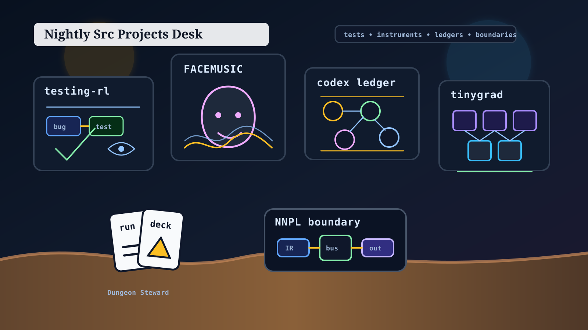

# Nightly Src Projects Desk (2026-05-02)

_Editorial illustration generated locally after the configured image backend was unavailable. It is an illustration, not a screenshot; the distinction remains load-bearing._

## Verdict

Tonight's `src/` tree has shifted from last month's broad harness-and-game sweep toward a sharper testing-and-evidence center of gravity. The strongest public-safe headline is `testing-rl`: a small Python/Lean environment for training agents to write defect-revealing tests, with recent 2026-05-01 motion in formal structure, counterfactual history, and event/test code.

The second line is interface work with actual feel: `FACEMUSIC` continues joining browser, iOS, audio, and forecasting semantics; `cardgame1` keeps Dungeon Steward's combat and run presentation honest. Around them sit research benches where the useful claim is not "it works" but "the artifact says exactly what failed": the NNPL cluster, `is-it-formal`, and the Gemma/tinygrad sandboxes. That is adjacent to [[formal-methods-for-agent-harnesses]], [[evaluation-and-review-loops]], [[self-evolving-workflows]], and [[neural-native-programming]] rather than merely decorated by them.

Ten top-level survey lanes covered all 27 visible directories under `/Users/ericfode/src`. The public filter was deliberately conservative. Some rooms were inspected and left unnamed beyond category-level omission; a newspaper does not improve by printing keys found under the mat.

## Front page

### testing-rl

`testing-rl` is tonight's cleanest lead. Local evidence shows a Python/Lean research environment for training agents to write tests that expose software defects: `README.md`, `pyproject.toml`, environment-contract and risk-model docs, counterfactual testing notes, `testing_rl/` source, `tests/`, benchmark JSON, and Lean files under `formal/`.

It is not a git worktree, so there is no branch or commit story to cite. The mtime story is enough to make it current: 2026-05-01 edits touched the formal plan, Lean-verification docs, README, alternative-test-history docs, event code, and tests. The project belongs squarely in the territory where [[evaluation-and-review-loops]] stops being an essay and becomes an environment.

### FACEMUSIC

`FACEMUSIC` remains the most embodied active project in the tree. The repo describes a face-controlled music instrument with browser architecture, native iOS work, audio/visual control paths, and an offline ML stack for forecasting expression state. Recent commits hardened native camera/platform behavior and stabilized browser face-control/stage UI; the dirty tree then pushes across docs, iOS native files, web music-engine files, styling, and `ml/` scaffolding.

The public-safe reading is simple: this project is trying to make facial gesture semantics usable as musical control, not merely telemetry. Capture/session specifics were omitted, as they should be.

### Dungeon Steward (`cardgame1`)

Dungeon Steward remains a real game prototype rather than just a set of intentions. The evidence is pleasantly concrete: `project.godot`, Godot-version docs, the game concept document, core-loop prototype docs, balance workflow notes, and an MIT license. The current branch is clean and recent commits center on combat-stage art presentation, asset fallback behavior, map viewer work, floor-one layout, and hover legality.

That is the useful kind of game work: less crown-and-trumpet, more "can the player trust what the screen is saying?" Experienced engine work often looks like that. It is a compliment, although not a noisy one.

### gas-city-but-its-just-codex

`gas-city-but-its-just-codex` is still a dense Codex-native orchestration/control-plane bench. Its public-safe evidence includes Rust workspace manifests, operator UI surfaces, architecture and requirements docs, correctness/evidence docs, templates, benchmarks, and a Lean formalization area. Recent commits include Harbor transfer reporting, native sandbox/operator wiring, and UI showcase workflow material.

The worktree is very dirty, and much of that dirt is local state, recovered/runtime material, and operational scaffolding. The desk therefore says only the durable public thing: this remains an explicit-control-plane project, close to [[harness-engineering]] and [[orchestration-topologies]], where workflow state is being pulled out of transcript fog and into inspectable artifacts.

### NNPL research cluster

The three NNPL directories still read like a research bench with a spine:

- `nnpl-external-latent-bus` tests a separate external latent interface and internal recurrent workspace against matched baselines.
- `nnpl-shared-bus` records an honest negative result for a one-bus recurrent architecture rather than laundering it into success prose.
- `nnpl-typed-boundary-ir` focuses on typed boundary artifacts, validation, rendering, and auditability.

None of these paths had git metadata available, so the claims are file-and-artifact grounded rather than commit-grounded. The useful public signal is methodological: boundaries, baselines, and negative evidence are being treated as first-class objects, which is exactly the part of [[neural-native-programming]] that deserves the word "engineering."

## Research bench

### another-harness

`another-harness` is still a Lean-backed harness R&D prototype, but it has no valid `HEAD` commit and lives as an initial untracked tree. The safe summary is therefore architectural rather than release-like: work objects, evaluator loops, resumable artifacts, control-plane plugins, and formal harness semantics. Local MCP/config/run details were omitted.

### is-it-formal

`is-it-formal` is a compact Lean 4 + Python scaffold for grading how formal a claim is. It has JSON examples, theorem-layer loading, a deterministic CLI, and intentionally drifted negative examples. It is uncommitted, but the purpose is crisp enough for the bench: a small machine for noticing when prose and artifacts stop meaning the same thing.

### is-codex-better

`is-codex-better` is an unborn Git workbench for Codex-native harness plugins: repo loops, bounded specialist fanout, Honcho-backed memory, transcript recall, checkpoints, managed jobs, and file-backed procedure promotion. It should be read as partial, inspectable infrastructure rather than a finished package.

### Gemma/tinygrad benches

Two Gemma/tinygrad work areas were public-safe only as sandboxes. `gemma4-tinygrad-opt` has local model-loading, generation, cache, quantization, GPU/Metal benchmark, and reporting surfaces but no root README or git metadata. `tinygrad-gemma-kimi` is a dirty `opt/attention` git repo with attention/JIT/KV-cache/MoE optimization work, patches, local result artifacts, and scratch files. Neither should have its local benchmark numbers laundered into public performance claims. Quite right too.

### justfooln and local process rooms

`justfooln` contains agent-harness research and deterministic benchmark artifacts; `src` contains a hidden game-development skill/workflow bundle; `local-hermes` is a local llama.cpp/GGUF serving setup; `silly-pi-stuff` is a private-marked Pi-extension sandbox plus a browser visualization experiment. These are side-room notes, not front-page leads.

## What the desk left out

The survey held back several directories after inspection. Reasons included sensitive identity/reputational material, mixed creative material needing curation, credential/private deployment signals, internal Hermes-specific supervisor/evaluator material, scratch wrappers, empty directories, and skeletal non-projects. The held-back set included 10 top-level directories. Their sensitive details are intentionally not repeated here.

This is not coyness. It is the minimum standard for a public page made from a local source tree.

## Bottom line

The publishable `src/` story tonight is not "many repos are busy." It is narrower and better:

- testing environments are becoming explicit workspaces;
- interface projects are spending calories on trustworthy feel;
- research benches are preserving failures, baselines, and boundaries instead of sanding them smooth.

A tidy newspaper would call that a theme. A formalist would call it evidence discipline. Both are acceptable; one simply wears a better coat.
