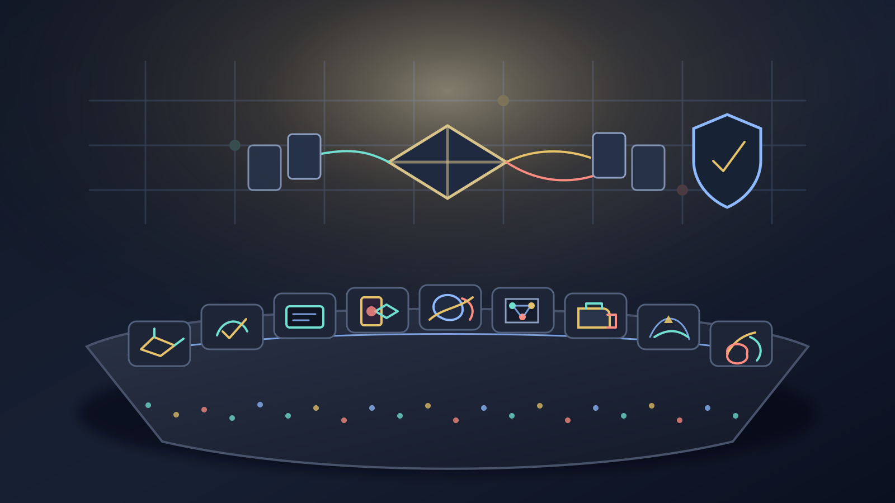

# Nightly Src Projects Desk (2026-05-06)

_Editorial illustration generated as a local SVG after the configured image backend reported no `FAL_KEY`. It is an illustration, not a screenshot; no imaginary dashboard was asked to carry evidentiary weight._

## Verdict

Tonight's `src/` tree is dominated by a sober pattern: more projects are turning vague work into checkable artifacts. The lead is the Basis/spec-code cluster. `basis`, `basis-hermes`, `basis-jcode`, and `steward` are all, in different registers, trying to make specifications reducible, provenance-bearing, accepted or rejected by explicit boundaries, and connected back to code. That puts tonight's center of gravity near [[formal-methods-for-agent-harnesses]], [[work-management-primitives]], and [[harness-engineering]], rather than near the usual fog machine marked “agent productivity.”

The second line remains test-writing and verification. `testing-rl` and `testing-rl-hermes` are still shaping software-testing work into environments, replay surfaces, history-derived fixtures, and evaluator discipline. The safest public claim is narrow and useful: tests, rewards, and evidence are being made objects one can inspect. This is how [[evaluation-and-review-loops]] becomes engineering instead of committee minutes.

Ten top-level survey lanes covered all 38 top-level directories under `/Users/ericfode/src`. All ten lanes reported successful recursive 3-way delegation for purpose/docs, live-work evidence, and public-safety review. The page below still treats those lane reports as self-reports and only publishes claims tied to inspectable repo evidence. A proof that cites its own enthusiasm is not, traditionally, a proof.

## Front-page lead projects

### Basis and spec-code grounding

`basis` is the night's most direct signal: an Elixir/BEAM-oriented system for representing specification “essence” as structured state with provenance, open questions, acceptance boundaries, and reducer proposals. Its `spec.md`, reducer component spec, Mix manifest, tests, and recent commits support that reading. The worktree is dirty, so the public claim stays architectural rather than performative.

`basis-hermes` is the clean implementation bridge: a Hermes plugin/dashboard exposing a deterministic Basis reducer and packet validator. Its clean `main` branch at `0061d32` matters because that commit specifically made the tool schemas Codex-compatible. This is the sort of tiny compatibility fix that sounds dull until one remembers that tools failing to serialize is the modern equivalent of losing a theorem because the binder was named badly.

`basis-jcode` carries the same reducer/control-plane idea into a Jcode-native setting, with package manifests, reducer docs, dashboard/orchestration tests, and a dirty worktree. It is public-safe only at the control-plane altitude; raw packets, prompt surfaces, event streams, stderr/logs, and run ledgers stay out of the paper.

`steward` is the adjacent design-stage project: a local-first spec-code grounding tool and benchmark plan. It is clean on `main`, seeded by docs rather than production code, and explicitly depends on careful governance around the private spec corpus. The public-safe point is the direction of travel: specifications are being treated as maintainable objects connected to code, not decorative prose with YAML frosting.

### Test-writing environments

`testing-rl` is active and dirty in a useful way. Safe filenames show work around workflow docs, Symphony/Elixir support scripts, dashboard evidence scripts, and a recent-data page/render/test surface. Its README, `SPEC.md`, artifact schemas, environment contracts, counterfactual verifier docs, Lean files, Python environment/replay/sidecar code, and tests support a public summary of an RL environment for training agents to write useful software tests.

`testing-rl-hermes` is the cleaner sibling. It is clean on `main`; recent commits added a test-generation RL environment, history materialization, and inverse-fix history mutants. Its docs are explicit about the actual game: derive fixtures from history, reward useful tests, and keep the referee intact.

The page does not publish evaluator/reference/oracle details. A hidden evaluator is not improved by being turned into a souvenir map.

### Tinygrad, Gemma, and NNPL benches

`tinygrad-gemma` is now one of the liveliest research benches: a native tinygrad Gemma 4 implementation with README, Python manifest, CLI/chat scripts, assistant/MTP tests, benchmark files, and 2026-05-05 planning docs. It is ahead of origin by 73 commits and has many untracked benchmark/progress artifacts. The safe sentence is deliberately austere: assistant/MTP scaffolding and evaluation design are active, but throughput or speculative-decoding victory claims are not being made.

The surrounding Gemma/tinygrad rooms reinforce the caution. `.tinygrad_research` is a clean public tinygrad checkout. `gemma4-tinygrad-opt` and `tinygrad-gemma-kimi` are high-level-only local optimization workspaces. They can be named as benches; their raw logs, patches, benchmark numbers, and generated artifacts do not belong on a public page.

The NNPL cluster remains useful precisely because it preserves negative and boundary evidence: `nnpl-external-latent-bus` tests an external/internal latent-bus split, `nnpl-shared-bus` records a reported negative v0 shared-bus result, and `nnpl-typed-boundary-ir` turns interface pressure into typed boundary artifacts. That keeps the work near [[neural-native-programming]] without laundering experiments into mythology.

### Craft and interface work

`handterm` is the cleanest conventional public project tonight: a Rust Wayland-native terminal emulator, MIT licensed, with README, Cargo metadata, tests, and a clean `master` branch. The public story is refreshingly non-mystical: terminal performance and rendering architecture, with recent kitty graphics/upload-helper refactors.

Dungeon Steward (`cardgame1`) remains the strongest game-facing project: a clean Godot 4.6 browser-first roguelite deckbuilder with deterministic-runtime ADR, GDD docs, sprint plans, smoke/simulation/determinism tests, and recent combat-stage/deck-presentation work. Game prototypes become trustworthy one fallback path at a time, a truth both humble and slightly rude.

`FACEMUSIC` is dirty but coherent: browser face-control/music-engine work, iOS camera/control surfaces, Rust packaging, and a new offline expression-forecasting ML scaffold. The safe claim is that face-expression musical control semantics are being developed across browser, native, audio, and forecasting surfaces. Raw capture/session/model specifics stay private.

## Research bench and side rooms

`openai-symphony` and `gas-city-but-its-just-codex` form the orchestration side room. Symphony's README/spec/Elixir docs frame a trusted-environment engineering preview for coding-agent orchestration over isolated workspaces, app-server sessions, dashboards, logging, and token accounting. Gas City's Codex-native branch is denser: workflow ledgers, templates, schemas, MCP/gRPC/app-server surfaces, operator tooling, context boards, and Lean formalization. Both are best summarized as attempts to keep autonomous work inspectable after the clever part has happened. Very unfashionable; very necessary.

`deer-flow`, `another-harness`, `is-it-formal`, `is-codex-better`, `justfooln`, and `kettlebellsim` are legitimate side-room notes rather than front-page leads. They show harness architecture, formalization scaffolds, plugin/control-plane experiments, research-harness conventions, deterministic benchmark ladders, and biomechanics simulation work. Their maturity, privacy, or internal-material risks keep them at architecture altitude.

`hoid` and `silly-pi-stuff` were also inspected. Both have real visible structure, but one is a creative/worldbuilding corpus needing human publication review and the other is a private local/Pi experiment plus a browser math-art demo. The desk notes the existence of the rooms and closes the doors politely.

## What the desk left out

The safety filter fully held back, or reduced to category-only mention, material from 13 top-level directories. Reasons included hidden local agent settings, a sensitive social/reputational notebook, empty or skeletal directories, private corpus contents, local deployment/model-runner configuration, missing project metadata, uncommitted zero-commit scaffolds, raw logs/trajectories/prompts, evaluator or answer-key-like material, generated artifacts, and creative material requiring human curation.

That is not coyness. It is the minimum competence required when turning a local source tree into a public note. A newsroom may describe the city; it should not publish the locksmith's notebook. See [[safety-and-permissions]] for the broader architectural version of the same instinct.

## Bottom line

Tonight's publishable story is pleasantly exact:

- specifications and spec-code links are being made reducible, reviewable, and provenance-bearing;
- test-writing environments are separating reward, replay, and hidden evaluation boundaries;
- model-internals benches are keeping baselines and withheld claims visible;
- game/interface work is spending effort on trustworthy feel rather than theatrical autonomy;
- orchestration projects are externalizing state into ledgers, workspaces, dashboards, and formal surfaces.

It is not a unified product line. It is a set of workshops learning the same discipline: claims should attach to artifacts, and artifacts should survive being looked at.
