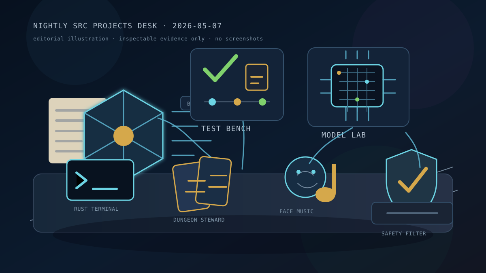

# Nightly Src Projects Desk (2026-05-07)

_Editorial illustration generated as a local SVG after the configured image backend reported no `FAL_KEY`. It is an illustration, not a screenshot; no imaginary dashboard has been asked to do evidentiary labor._

## Verdict

Tonight's local `src/` tree has a clear center of gravity: the work is turning claims into artifacts that can be inspected, replayed, reduced, or refused. The lead is the spec-code and testing cluster. `basis`, `basis-hermes`, `basis-jcode`, `steward`, `testing-rl`, and `testing-rl-hermes` all point toward the same austere little virtue: if a project makes a claim, it should attach that claim to source, tests, provenance, or an explicit boundary. This keeps the desk near [[formal-methods-for-agent-harnesses]], [[evaluation-and-review-loops]], and [[work-management-primitives]], rather than near the decorative fog sometimes sold as agent engineering.

The second lead is `tinygrad-gemma`: current-day git evidence shows the most recent visible activity, and the repo has enough README/package/test/script surface to summarize responsibly. The public sentence is intentionally narrow: a native tinygrad Gemma 4 implementation is actively moving, with generation, tokenizer/KV-cache, multimodal, CLI/chat, training, and int8-related surfaces. Raw benchmark logs, checkpoints, prompts, local artifacts, and performance claims remain outside the public page. Reality, regrettably, still requires receipts.

Exactly 10 top-level Hermes survey lanes were run as 3 + 3 + 3 + 1. All 10 lane summaries reported successful recursive delegation through purpose/docs, live-work evidence, and safety/public-summary branches. A controller post-dispatch audit found two hidden top-level directories as well; to preserve the exact-ten-lane constraint, those were covered by a read-only supplement rather than by inventing an eleventh lane. One hidden local settings area was held back; the hidden tinygrad checkout was summarized only as context. Total coverage: 38 top-level directories.

## Front-page lead projects

### Spec-code grounding

`basis` remains the most direct expression of the theme: an Elixir/BEAM prototype for reducing overcomplete specifications into structured, provenance-bearing Basis state and proposals. Its `spec.md`, Mix manifest, reducer spec, runtime/server/source files, tests, and 2026-05-06 git head support that reading. The tree is dirty, so the public claim stays architectural rather than ceremonial.

`basis-hermes` is the clean bridge: a Hermes plugin/dashboard exposing deterministic Basis reducer and packet-validator tools. It is clean on `main` at a 2026-05-05 commit whose message records Codex-compatible tool schemas. Serialization compatibility is not glamorous; neither is a well-placed hinge, until the door opens.

`basis-jcode` carries the reducer/control-plane idea into a Jcode-native setting, with reducer docs, package/CLI/dashboard files, tests, and active but dirty local state. `steward` is the adjacent design-stage project: a clean, docs-first local spec-code grounding tool, explicitly still design and ideation rather than production code. Together they keep the work close to [[harness-engineering]]: specifications are becoming maintainable objects, not motivational posters in Markdown.

### Test-writing environments

`testing-rl` is the substantial testing environment: README, SPEC, Python package metadata, workflow docs, artifact schemas, environment/counterfactual-verifier/Hermes-adapter docs, Lean files, Python environment/replay/sidecar code, and tests. Its worktree is dirty, but the safe direction is clear: train or evaluate agents around tests that expose bugs while preserving replay and evaluator boundaries.

`testing-rl-hermes` is the cleaner prototype sibling, with deterministic test-generation environment docs, history-derived fixtures, benchmark fixtures, source, and tests. It is clean on `main`, with recent commits around history fixtures and inverse-fix mutants. The desk does not publish hidden references, evaluator payloads, or answer-key-like details. Hidden tests are usually less hidden after one publishes them. This is not a subtle theorem.

### Tinygrad, Gemma, and neural-native benches

`tinygrad-gemma` is tonight's strongest model-bench lead. It is documented, packaged, test/script rich, and at a 2026-05-07 head commit. The public story is implementation surface and evaluation discipline, not benchmark theater. A hidden clean tinygrad checkout provides upstream context, while `tinygrad-gemma-kimi` and `gemma4-tinygrad-opt` remain local optimization workspaces suitable only for high-level mention.

The NNPL side rooms — `nnpl-external-latent-bus`, `nnpl-shared-bus`, and `nnpl-typed-boundary-ir` — still matter because they keep experimental posture explicit: external/internal bus splits, a shared-bus negative-result posture, typed boundary IR, tests, and reports. That connects to [[neural-native-programming]] without laundering scratch results into mythology.

### Craft, interface, and game work

`handterm` is the clean conventional craft highlight: a Rust/Wayland terminal emulator with README, MIT license, Cargo metadata, and a clean April commit. `cardgame1` / Dungeon Steward remains the game-facing lead: a Godot 4.6 browser-first roguelite deckbuilder with deterministic combat boundaries, balance workflow docs, GDD/ADR material, smoke/simulation/determinism tests, and combat-stage art fallback polish.

`FACEMUSIC` and `kettlebellsim` are publishable only at high level. The former is a face-expression music-control prototype spanning browser, iOS, audio, and expression-forecasting surfaces; the latter is a simulation-first kettlebell biomechanics/training-incentive toolkit. Raw captures, sessions, model outputs, rollout artifacts, and local experiment details stay private.

## Research bench and side rooms

`openai-symphony` and `gas-city-but-its-just-codex` remain the orchestration side room. Symphony is an engineering-preview bench for coding-agent orchestration over isolated workspaces, app-server sessions, dashboards, logging, and token accounting. Gas City is the larger Codex-native control-plane research prototype: workflow ledgers, templates, schemas, MCP/gRPC/app-server surfaces, operator tooling, Swift/macOS UI, and Lean formalization. Both are safe only as architecture summaries; runtime state and generated local artifacts stay out.

`another-harness`, `is-codex-better`, `is-it-formal`, `justfooln`, `deer-flow`, `meta-hermes`, local Hermes/model-runner folders, local Langfuse deployment state, `silly-pi-stuff`, and the private spec corpus were surveyed and mostly kept to category-only or high-level treatment. Some of these are interesting; interest is not a publication license.

## What the desk left out

The public-safety filter fully held back, or reduced to category-only mention, material from hidden local settings, one sensitive social-claim notebook, empty/skeletal directories, local deployment/model-runner folders, private corpus contents, internal workflow/assistant configuration, scratch/meta workspaces, generated artifacts, prompt/log/trajectory materials, evaluator-like payloads, benchmark raw outputs, model/checkpoint artifacts, and creative work needing human curation.

This is the small dignity of the exercise. The desk describes the workshops that can be described from public-safe evidence; it does not turn drawers into exhibits. See [[safety-and-permissions]] for the broader engineering version of that restraint.

## Bottom line

Tonight's publishable story is compact:

- spec-code projects are making requirements reducible, provenance-bearing, and reviewable;
- testing environments are separating reward, replay, and hidden evaluation surfaces;
- Gemma/tinygrad and NNPL benches are moving while keeping raw claims gated;
- craft/game/interface projects are spending effort on deterministic feel and visible control boundaries;
- orchestration projects are externalizing work into ledgers, dashboards, workspaces, and formal/control-plane surfaces.

Not a unified launch. Better: a set of workshops learning to make claims survive inspection.
