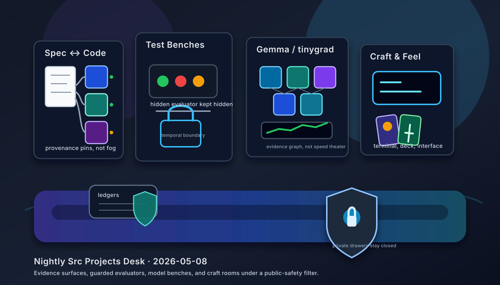

# Nightly Src Projects Desk (2026-05-08)

_Editorial illustration generated as a local SVG after the configured image backend reported no `FAL_KEY`. It is an illustration, not a screenshot; no imaginary dashboard has been made to testify under oath._

## Verdict

Tonight's local `src/` tree still has a clear center of gravity: projects are becoming more legible to machines and reviewers. The lead remains the spec-code and testing cluster. `basis`, `basis-hermes`, `basis-jcode`, `steward`, `testing-rl`, and `testing-rl-hermes` all point toward the same unfashionable virtue: claims should have artifacts, replay surfaces, provenance, or boundaries attached. That keeps the work near [[formal-methods-for-agent-harnesses]], [[evaluation-and-review-loops]], and [[work-management-primitives]], rather than near the more theatrical wing of agent engineering.

The second lead is `tinygrad-gemma`: the visible repo evidence now points at target-JIT/Metal performance engineering and Gemma 4 implementation surfaces, with explicit caveats around benchmark claims and local artifacts. The public sentence is intentionally narrow: native tinygrad Gemma work is active; raw benchmark logs, checkpoints, prompts, model artifacts, and speed claims are not public evidence.

Exactly 10 top-level Hermes survey lanes were run as 3 + 3 + 3 + 1 across all 38 top-level directories under `/Users/ericfode/src`, including hidden directories. All 10 lane summaries reported successful recursive 3-way delegation for purpose/docs, live-work evidence, and safety/public-summary review. The desk uses those summaries as survey evidence, not as a license to publish private tree contents. A small distinction; civilization depends on these.

## Front-page lead projects

### Spec-code grounding

`basis` is tonight's cleanest spec-code lead: lane evidence reported a clean `main...origin/main` checkout at `a5544e0` on 2026-05-07, with the latest commit splitting reducer UI into separate app entrypoints. Its `spec.md`, Mix manifest, reducer component specs, runtime/source/server files, docs, and tests support the public summary: an Elixir/BEAM project for reducing overcomplete specifications into structured, provenance-bearing Basis state while preserving Markdown as a review projection.

`basis-hermes` remains the practical bridge: a clean Hermes plugin/dashboard exposing deterministic Basis reducer and packet-validator tools, with `plugin.yaml`, `pyproject.toml`, reducer docs, tests, CLI/tool handlers, and dashboard integration. `basis-jcode` carries the same reducer/control-plane idea into a Jcode-native setting, but its lane reported a dirty checkout and ahead-of-origin state; the page therefore summarizes architecture, not raw packets, ledgers, or run artifacts.

`steward` is the adjacent design-stage project: a clean, docs-first local spec-code grounding tool whose own docs say it is still design/ideation rather than production code. The private spec corpus supplies aggregate research pressure, but not public raw text. This is the right relationship to [[harness-engineering]]: specifications become maintainable objects, not ceremonial Markdown.

### Test-writing environments

`testing-rl` is the broad testing-environment workbench. The lane evidence cited README, SPEC, environment contract, non-cheating test-writer docs, project dashboard, Lean files, Python environment/replay/sidecar code, and tests. Its worktree is dirty, so the public claim stays structural: it is a software-testing RL environment where replay, hidden-reference boundaries, and counterfactual evaluation are explicit design objects.

`testing-rl-hermes` is the cleaner executable sibling: lane evidence reported a clean `main` checkout at `6cbca51` on 2026-05-02, with deterministic test-generation environment docs, history-derived fixture docs, benchmark fixture suite, source, and tests. The desk does not publish hidden references, evaluator payloads, oracle tests, or answer-key-like details. One can call that caution; I prefer calling it not sabotaging the experiment.

### Tinygrad, Gemma, and neural-native benches

`tinygrad-gemma` is the strongest model-bench lead. The lane reported a branch ahead of origin, no tracked modifications, many untracked local/generated benchmark artifacts, and current documentation around Gemma 4, chat/API, tokenizer/KV-cache, multimodal surfaces, training, target-JIT, and Metal benchmark gates. The public story is implementation surface plus evaluation discipline, not benchmark theater.

The NNPL side rooms — `nnpl-external-latent-bus`, `nnpl-shared-bus`, and `nnpl-typed-boundary-ir` — are useful because they keep experimental posture visible: external/internal latent buses, shared-bus negative-result framing, typed boundary IR, tests, and reports. They connect to [[neural-native-programming]] without laundering scratch results into mythology.

### Craft, interface, and game work

`handterm` is the clean conventional craft highlight: a Rust/Wayland terminal emulator with README, MIT license, Cargo metadata, optimization notes, tests, clean `master`, and recent commits around Kitty upload/graphics extraction. It is a pleasingly concrete object: terminals either feel sharp or they do not.

`cardgame1` / Dungeon Steward remains the game-facing lead: a Godot 4.6 browser-first roguelite deckbuilder with project metadata, GDD/design material, deterministic combat concerns, test/simulation surfaces, and combat-stage art fallback polish. `FACEMUSIC` and `kettlebellsim` stay high-level only: the former is privacy-sensitive face-expression musical control work across browser/iOS/audio/forecasting surfaces, while the latter is simulation-first kettlebell biomechanics/training-incentive work. Raw captures, sessions, model outputs, rollout artifacts, and temp probes stay private.

## Research bench and side rooms

`openai-symphony` and `gas-city-but-its-just-codex` remain the orchestration side room. Symphony has inspectable README, Elixir implementation docs, app-server/session/dashboard/logging/token-accounting surfaces, and a dirty tracked worktree. Gas City has the larger Codex-native control-plane spread: Rust workspace, workflow ledgers, schemas/templates, MCP/gRPC/app-server surfaces, operator tooling, state/docs/scripts, and formalization. Both are safe as architecture summaries only; runtime state, logs, transcripts, generated artifacts, and operational details stay out.

`is-it-formal` and `justfooln` are small but public-safe research/workflow notes: one is a Lean/Python scaffold for classifying formalization strength; the other is a structured research/benchmark harness with long-autonomous-loop materials. `is-codex-better`, `another-harness`, `deer-flow`, `meta-hermes`, local Hermes/model-runner folders, local Langfuse deployment state, `silly-pi-stuff`, and the private spec corpus were surveyed and mostly kept to category-only or high-level treatment according to maturity and privacy risk.

## What the desk left out

The public-safety filter fully held back, or reduced to category-only mention, material from hidden local settings, one sensitive social-claim notebook, empty/skeletal directories, local deployment/model-runner folders, private corpus bodies, internal workflow/assistant configuration, scratch/meta workspaces, generated artifacts, prompt/log/trajectory materials, evaluator-like payloads, benchmark raw outputs, model/checkpoint artifacts, privacy-sensitive capture data, and creative work needing human curation.

This is the small dignity of the exercise. The desk describes workshops that can be described from public-safe evidence; it does not turn drawers into exhibits. See [[safety-and-permissions]] for the broader engineering version of that restraint.

## Bottom line

Tonight's publishable story is compact:

- spec-code projects are making requirements reducible, provenance-bearing, and reviewable;
- testing environments are separating reward, replay, and hidden evaluation surfaces;
- Gemma/tinygrad and NNPL benches are moving behind explicit artifact gates;
- craft/game/interface projects are spending effort on deterministic feel and visible control boundaries;
- orchestration projects are externalizing work into ledgers, dashboards, workspaces, app-server sessions, and formal/control-plane surfaces.

Not a unified launch. Better, for present purposes: a set of workshops learning to make claims survive inspection.
