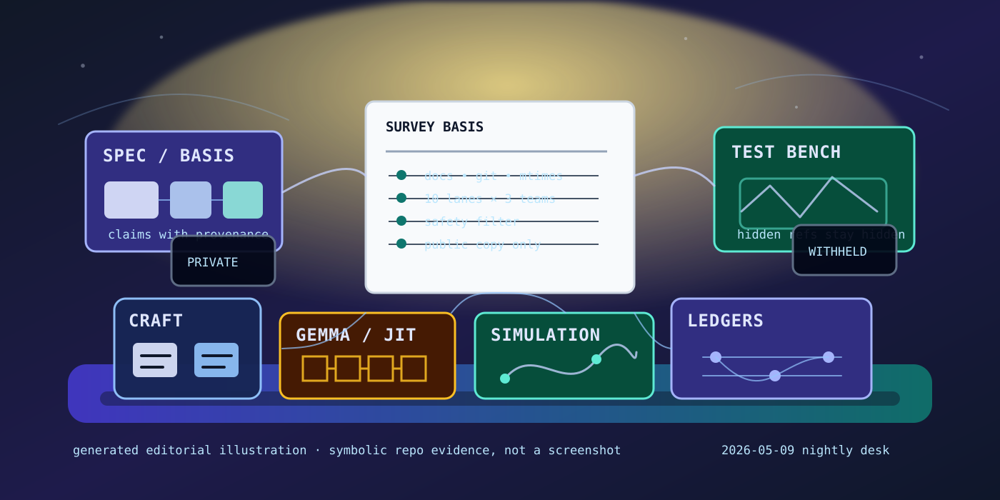

# Nightly Src Projects Desk (2026-05-09)

_Editorial illustration generated locally as SVG. It is symbolic art, not a screenshot; no dashboard has been framed for a crime it did not commit._

## Verdict

Tonight's local `src/` tree is still led by evidence-bearing infrastructure: spec-code projects, test-generation environments, and model/simulation benches with explicit gates. The new bit of motion is not a slogan but a pattern: more directories now expose claims through manifests, tests, runbooks, plans, Lean surfaces, ledgers, or benchmark protocols. This keeps the work close to [[formal-methods-for-agent-harnesses]], [[evaluation-and-review-loops]], and [[work-management-primitives]], where it belongs when the claim is supposed to survive contact with an actual repository.

Exactly 10 top-level Hermes survey lanes covered all 38 top-level directories under the local `src/` root, including hidden directories. The lanes ran as 3 + 3 + 3 + 1. All 10 lane summaries reported three-way delegation for docs/purpose, live-work evidence, and public-safety review, plus a further three-way leaf recursion where the runtime allowed it. The second recursion ended at leaves because of the configured depth cap; that is a limit, not a scandal. Bounds are what make automation less theatrical.

The public page is deliberately narrower than the private tree. Hidden settings, private corpus bodies, prompt/log/trajectory materials, evaluator payloads, raw benchmark outputs, checkpoints, biometric captures, creative canon drafts, local deployment state, and sensitive/provocative material were held back or reduced to category-only mention. See [[safety-and-permissions]] for the grown-up version of this restraint.

## Front-page lead projects

### Spec-code grounding

`basis` remains the cleanest spec-state lead: a clean `main` checkout at `a5544e0` from 2026-05-07, with `spec.md`, Mix metadata, reducer and implementation-imaginer component specs, docs, and tests. The safe public claim is precise: it is an Elixir/Mix project for reducing prose/spec artifacts into structured, provenance-backed specification state.

`basis-hermes` remains the practical bridge into Hermes: clean `main` at `0061d32` from 2026-05-05, with plugin metadata, Python package metadata, reducer/dashboard material, and Python/JS tests. `basis-jcode` carries the same reducer/control-plane idea into a Jcode setting, but it is dirty and ahead-of-origin; the page therefore summarizes architecture only, not run packets, prompts, ledgers, event streams, or validation bodies. A reducer that reduces discretion is charming; a public page that leaks its private run tree would be less so.

`steward` is the docs-first adjacent project: clean `main` at `ba88837` from 2026-05-05, with charter, benchmark spec, architecture, implementation plan, data-governance, modeling, workflow, and decision-log documents. Its source and tests are still placeholder-shaped, so it is design-stage evidence rather than implementation evidence.

### Test-writing environments

`testing-rl` is the broader environment lead. Its `README`, `SPEC`, package manifest, environment contract, artifact schemas, risk/replay/counterfactual docs, Hermes/Atropos/Tinker adapter docs, Lean files, benchmark task filenames, and test suite support a public summary: an RL/test-generation environment for writing high-value tests against hidden reference behavior while preserving replay, evidence, and boundary objects. Its worktree is dirty, with recent page/script/test material; the raw evaluator, benchmark, replay, and hidden-reference bodies stay private.

`testing-rl-hermes` is the cleaner executable sibling: clean `main` at `6cbca51` from 2026-05-02, with a package manifest, master plan, adversarial risk review, test-generation environment docs, history-derived fixture docs, benchmark suite, reports, source, and tests. It remains safe to describe as a prototype for history-derived test-generation fixtures and sidecar/supervisor-style grading — not as a venue for publishing answer keys in a trench coat.

### Tinygrad, Gemma, and NNPL benches

`tinygrad-gemma` is still the strongest model-bench lead: `main` at `11470a3` from 2026-05-07, ahead of local upstream by 93 commits, with no tracked source changes and many untracked local artifacts. Its public evidence includes README/package metadata, CI, 119 plan files, and 17 tests around model behavior, chat server, benchmark helpers, profile/JIT tooling, assistant/MTP decode, Modal/evo fanout, and raw Metal controls. The safe sentence is intentionally disciplined: native tinygrad Gemma 4 work is active across loading, tokenizer/KV-cache generation, text/multimodal paths, training/checkpoint surfaces, CLI, and chat entry points. Raw benchmark outputs, prompts, model artifacts, checkpoints, and speed claims stay out.

`gemma4-tinygrad-opt` showed fresh 2026-05-09 worker/test mtimes in a non-git optimization sandbox with model/runtime/tokenizer/loading scripts, Metal/backend benchmark scripts, and a nested tinygrad checkout. `tinygrad-gemma-kimi` remains a dirty attention/JIT/correctness workbench rather than a publishable package. The NNPL side rooms — `nnpl-external-latent-bus`, `nnpl-shared-bus`, and `nnpl-typed-boundary-ir` — remain useful because they publish methodology and boundaries: two-space external/internal latent buses, shared-bus mixed or negative evidence, and typed boundary IR for legality, auditability, and replanning. They belong near [[neural-native-programming]], but the raw metrics, traces, rollouts, and result bodies do not.

### Simulation, game, interface, and craft

`kettlebellsim` is tonight's most visibly fresh non-harness motion: branch `codex/reward-audit-and-swing-training` at `1d973def` on 2026-05-09, ahead 36, with no tracked modifications and recent bounded Modal Isaac probe wrapper docs, script, and test mtimes. The public summary is a Python research toolkit for simulation-first kettlebell swing/path-signature/biomechanics experiments with deterministic planar restart and remote simulator/RL scaffolding. The local temp/helper files, reports, trajectories, service configuration, and prompt-like council material stay private.

`cardgame1` / Dungeon Steward remains the game-facing craft lead: a clean Godot 4.6 project with GDD/design docs, deterministic combat concerns, generated-art workflow, CI, and deterministic/simulation/smoke tests. `handterm` is the clean conventional craft highlight: a Rust/Wayland terminal emulator with README, Cargo metadata, optimization notes, tests, and a clean `master` at `977e709`. `FACEMUSIC` is public-safe only at the high level: Rust audio, browser/iOS control surfaces, and offline ML scaffolding for face-controlled music. Biometric captures, ML runs, checkpoints, saliency/probe outputs, and sessions are not public evidence.

## Research bench and side rooms

`gas-city-but-its-just-codex` and `openai-symphony` remain the orchestration side room. Gas City has the larger Codex-native spread: Rust workspace, workflow-ledger specifications, schemas/templates, MCP/gRPC/app-server surfaces, operator tooling, state/docs/scripts, and Lean formal material. Symphony has Elixir/Phoenix/LiveView surfaces for issue-driven isolated autonomous runs, structured logs, status dashboards, app-server interaction, and token accounting. Both are safe as architecture summaries; runtime state, logs, transcripts, databases, tracker payloads, local context boards, app-server sessions, workflow IDs, and prompt-like skill material stay out.

`another-harness`, `is-codex-better`, `deer-flow`, `is-it-formal`, `justfooln`, local `langfuse`, `local-hermes`, `meta-hermes`, `silly-pi-stuff`, the private spec corpus, and several skeletal/empty directories were surveyed. They are useful as pressure signals or side rooms, but not all deserve a public paragraph tonight. The standard is not whether a directory is interesting; the standard is whether the inspectable evidence can be summarized without laundering private machinery into public prose.

## What the desk left out

The public-safety filter fully held back, or reduced to category-only mention, hidden local settings, a sensitive social-claim wiki, empty/skeletal directories, local deployment/model-runner folders, private corpus raw bodies, prompt/agent/skill instruction bodies, scratch/meta workspaces, generated media, raw logs/prompts/trajectories, evaluator-like payloads, hidden references/oracles, benchmark raw outputs, model/checkpoint artifacts, privacy-sensitive capture data, story/canon drafts, local service configuration, and cache/build/vendor directories.

This is not timidity. It is table stakes for turning a private source tree into a public note without pretending every local artifact is a press release.

## Bottom line

Tonight's publishable story is compact:

- spec-code work is becoming more structured, provenance-bearing, and reviewable;
- test-generation environments are making hidden-reference and replay boundaries explicit;
- tinygrad/Gemma and NNPL benches are active behind clear artifact gates;
- simulation, terminal, game, and interface craft projects have real docs/tests/manifests rather than only vibes;
- orchestration projects keep externalizing work into ledgers, dashboards, formal surfaces, and operator planes.

A set of workshops, not a launch. Good. Workshops are where claims learn to carry their own weight.
