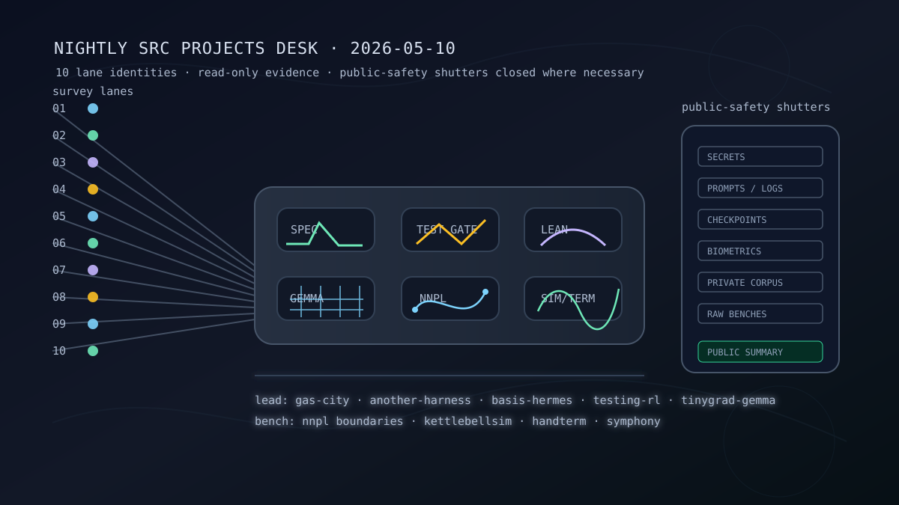

# Nightly Src Projects Desk (2026-05-10)

_Editorial illustration generated locally as SVG. It is symbolic art, not a screenshot; no terminal window was made to stand in a lineup._

## Verdict

Tonight's `src/` tree is led by infrastructure that insists on leaving evidence: harness/control-plane work, spec reducers, test-generation environments, tinygrad/Gemma benches, NNPL boundary experiments, and a few craft projects with real manifests and tests. The interesting through-line is not novelty but constraint. More projects are exposing their claims through READMEs, package metadata, test suites, formal surfaces, ledgers, dashboards, or explicit negative results. That is the part worth publishing, and it sits neatly beside [[formal-methods-for-agent-harnesses]], [[evaluation-and-review-loops]], and [[work-management-primitives]].

Exactly 10 top-level Hermes survey lane identities ran over all 38 top-level directories under the local `src/` root, including hidden directories. All lane summaries reported three-way delegation for purpose/docs, live-work evidence, and public-safety review, plus one further three-way leaf recursion. A controller audit corrected a lane spelling slip for the three `nnpl-*` directories; the top-level lane count remained exactly 10, and the corrected audit used the same read-only evidence rules. Boundaries remain useful. It is almost as if engineering has been trying to tell us something.

The public page is deliberately narrower than the private tree. Hidden settings, private corpus bodies, local deployment state, prompt/log/trajectory material, raw benchmark outputs, checkpoint/model artifacts, biometric/capture data, creative canon drafts, generated media bodies, explicit/provocative material, and skeletal placeholders were held back or reduced to category-only mention. See [[safety-and-permissions]] for the less theatrical version of this restraint.

## Front-page lead projects

### Harness/control-plane work

`gas-city-but-its-just-codex` remains the strongest orchestration lead: a Rust/Lean/operator workspace with workflow-ledger specifications, schemas/templates, MCP/gRPC/app-server surfaces, operator tooling, tests, and formal material. The safe public claim is architectural: Codex-native durable workflow orchestration and control-plane research. Runtime state, transcripts, database files, benchmark payloads, workflow IDs, and live operator state stay private.

`another-harness` is newly prominent but must be named with a raised eyebrow: the evidence is strong enough to mention, but the repo has no commits yet and hundreds of untracked entries. Its README, Lean/Lake scaffold, docs, tests, tools, benchmarks, and plugins support a safe summary as an early Codex-native harness/formalization workspace. The untracked state means no claims about maturity, stability, or public release. A theorem with no proof term is merely a mood; an unborn repo is similar.

`openai-symphony` stays in the orchestration side room: Elixir/Phoenix material for issue-tracker-driven isolated coding-agent runs, status dashboards, app-server interaction, and token/logging observability. Useful, active, and not a license to publish logs, prompt bodies, hidden tooling, or local runtime details.

### Spec-code grounding

`basis-hermes` is the cleanest spec-code lead tonight: a clean Python/Hermes plugin with `plugin.yaml`, `pyproject.toml`, dashboard manifest, reducer/validator source, CLI/tool handlers, and tests. It is safe to describe as the Hermes-native Basis reducer and packet-validator surface.

`basis` remains the compact upstream idea: an Elixir/Mix project for reducing prose/spec artifacts into structured, provenance-backed specification state. `basis-jcode` carries the reducer/control-plane pattern into a Jcode setting, but it is ahead of origin and dirty; summarize the architecture, not the run trees. `steward` and `is-it-formal` are design/formal side rooms: the former docs-first spec-code governance and benchmark planning, the latter an early Lean-backed scaffold for grading claim formalization strength.

### Test-generation environments

`testing-rl` remains a front-page lead because its evidence is explicit: README/SPEC, package metadata, docs dashboard, artifact schemas, risk/replay/counterfactual docs, adapter docs, Lean files, benchmark task filenames, and tests. The public claim is bounded: a prototype environment for training or evaluating agents that write valuable software tests against hidden reference behavior. It explicitly warns that local candidate-test execution is not a security sandbox, which is the kind of sentence that makes a system more trustworthy, not less.

`testing-rl-hermes` is the quieter sibling: local, clean, no remote configured, with plans, risk review, deterministic-runner docs, history-derived fixture docs, reports, source, and tests. Category-level public treatment is enough; hidden references, oracle/mutant bodies, evaluator internals, raw benchmark JSON, prompt trajectories, and replay artifacts stay out.

### Tinygrad, Gemma, and NNPL

`tinygrad-gemma` remains the model-bench lead: native tinygrad Gemma 4 package/runtime evidence, CLI/chat entry points, tokenizer and multimodal support, Metal-related surfaces, configs, docs, scripts, tests, and an ahead-of-origin branch with recent worker-round commits. The page can say the bench is active. It cannot honestly publish checkpoint details, raw logs, or speed claims without a separate audited benchmark note.

The NNPL family has the most useful research-desk texture tonight. `nnpl-external-latent-bus` documents a two-space external/internal latent bus with explicit bridges and option-preserving planning benchmarks. `nnpl-shared-bus` is especially valuable because it records an honest v0 negative/insufficient result for the shared-bus thesis. `nnpl-typed-boundary-ir` keeps the typed-boundary idea tied to legality, auditability, deterministic rendering, and failure localization. This is exactly the sort of work that belongs near [[neural-native-programming]]: not because it is grand, but because it is falsifiable.

## Research bench and side-room notes

`kettlebellsim` remains a strong simulation side room, with clean git state, recent 2026-05-09 Modal/Isaac/planar handoff commits, package metadata, docs, scripts, configs, recipes, skills, and extensive tests. The safe claim is simulation-first kettlebell path-signature and biomechanics research. Trajectories, generated media, reports, service configuration, and prompt-like council material remain private.

`handterm` is the clean craft highlight: a Rust/Wayland terminal emulator with README, Cargo workspace, optimization docs, tests, and recent graphics/kitty-upload refactors. It is wonderfully concrete. No one had to invoke “agentic synergy”; the Cargo manifest did the work.

`FACEMUSIC`, `hoid`, `cardgame1`, `deer-flow`, `is-codex-better`, `meta-hermes`, local `langfuse`, `local-hermes`, the private spec corpus, and local Pi/assistant experiments were surveyed. Some are technically interesting; several are simply not public copy tonight. Biometric/capture-adjacent work, private creative/canon material, local deployment/model-runner configuration, private corpus contents, generated media, prompt/system bodies, and all-empty placeholders stay behind the filter.

## What the desk left out

The public-safety filter fully held back, or reduced to category-only mention, hidden local settings, hidden-only directories, empty/skeletal placeholders, one sensitive social-claim note set, local deployment and model-runner folders, private corpus bodies, prompt/agent/skill instruction bodies, scratch/meta workspaces, generated media, raw logs/prompts/trajectories, evaluator-like payloads, hidden references/oracles, benchmark raw outputs, model/checkpoint artifacts, biometric/capture data, creative story/canon drafts, service configuration, and cache/build/vendor directories.

This is not coyness. It is the minimum ceremony required to turn a private source tree into a public note without laundering the private tree into public prose.

## Bottom line

Tonight's publishable story is compact:

- harness/control-plane projects are externalizing work into ledgers, dashboards, app-server bridges, tests, and formal surfaces;
- spec-code projects are making reduction, provenance, and packet validation first-class;
- test-generation environments are exposing reward, replay, hidden-reference, and sandbox boundaries;
- tinygrad/Gemma and NNPL workbenches are active, but their benchmark and artifact gates still matter;
- simulation, terminal, and interface work remain strongest when they bring manifests and tests rather than just vibes.

A workshop floor, not a launch stage. Good. Launch stages are where claims learn cosmetics; workshops are where they learn load-bearing behavior.
