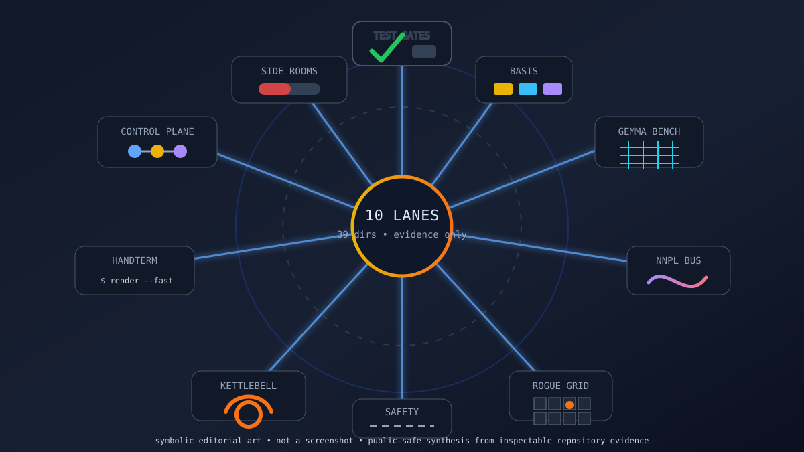

# Nightly Src Projects Desk (2026-05-11)

_Editorial illustration generated locally as SVG. It is symbolic art, not a screenshot; the glyphs stand for project clusters, not for imaginary terminal windows auditioning for realism._

## Verdict

Tonight's `src/` tree is led by test-generation environments, Basis/spec-code work, Gemma/tinygrad benches, a new symbolic roguelike research workspace, NNPL boundary experiments, and a small set of clean craft/simulation projects. The useful pattern is again evidential rather than glamorous: the publishable work is the work with READMEs, manifests, schemas, tests, design docs, branch/status evidence, or explicit caveats. That puts it close to [[evaluation-and-review-loops]], [[formal-methods-for-agent-harnesses]], and [[work-management-primitives]].

Exactly 10 top-level Hermes survey lane identities covered all 39 top-level directories under the local `src/` root, including hidden directories. All 10 lanes reported three-way delegation for purpose/docs/manifests, live-work evidence, and public-safety review, plus one further three-way leaf recursion where the runtime allowed it. A controller read-only audit re-enumerated the tree afterward and found no missing top-level directory. The public page is deliberately narrower than the private tree, which is not coyness but hygiene. See [[safety-and-permissions]] for the less decorative name for that habit.

## Front-page lead projects

### Test-generation and verifier work

`testing-rl` is the strongest live-work lead tonight. Its git state shows active May 10 work, with README, pyproject entry points, environment contracts, artifact schemas, dashboard material, replay/risk/counterfactual/verifier docs, Lean material, adapters, and tests. The safe public claim is bounded: a prototype RL-style environment for agents that write valuable tests against bounded buggy workspaces and hidden reference/replay evidence. Raw reward feeds, private/local corpus details, dashboard payloads, benchmark bodies, logs, prompts, and trajectories stay private.

`testing-rl-hermes` remains the smaller clean sibling: a local prototype for artifact-first test-generation RL with supervisor-held references/mutants and deterministic grading concepts. It is experimental, not production-grade, and the hidden fixture/oracle/mutant bodies remain out of public copy.

### Basis, Steward, and spec-code grounding

`basis` and `basis-hermes` remain safe front-page material: the former is the Elixir/BEAM reducer idea for structured, provenance-backed specification state; the latter is the clean Hermes plugin exposing deterministic reducer and validator surfaces. `basis-jcode` is still useful but category-level tonight because it is ahead/dirty and run-artifact heavy.

`steward` has fresh design movement: modified design docs plus service-vision, ADR, schema, and query-contract material. The public claim should be careful: a design-stage semantic/provenance service concept over specs, code, Git history, agent work, reasoning, and verification. It is not yet an implemented product. The distinction is small only to people who enjoy false theorems.

### Gemma, tinygrad, symbolic game state, and NNPL

`gemma-dungeon` is the new front-page research object: a clean repo with a 2026-05-11 HEAD, README, pyproject, docs/specs, schemas, tests, and package surfaces for an embedding-native, symbolically audited roguelike workspace. The safe public claim is about explicit game state, legal-action scoring, replay/schema contracts, and Gemma/tinygrad policy experiments. Replay payloads, exports, prompt/logit artifacts, datasets, and internal plans remain private.

`tinygrad-gemma` stays important: native tinygrad Gemma 4 package/runtime evidence, CLI/chat entry points, tokenizer and multimodal support, KV-cache generation, training/checkpoint helpers, quantization surfaces, docs, tests, CI, and recent worker-round commits. It is active, but the page does not publish checkpoint details, raw benchmark logs, or speed claims.

The NNPL side bench is still worth a sober paragraph. `nnpl-external-latent-bus` and `nnpl-typed-boundary-ir` have strong docs/manifests/tests and can be described as research prototypes for external/internal latent buses and typed planning boundaries. `nnpl-shared-bus` is useful precisely because it records limited/negative evidence, but raw runs, traces, checkpoints, and evaluation payloads keep it category-level. This belongs near [[neural-native-programming]] only if the word “research” still means “can be wrong in public.”

### Harness/control planes and orchestration rooms

`gas-city-but-its-just-codex`, `another-harness`, `openai-symphony`, `deer-flow`, and `is-codex-better` were all surveyed. The safe story is architectural: workflow ledgers, app-server/control-plane surfaces, issue-tracker-driven isolated runs, LangGraph/LangChain harness material, plugins, and formal/Lean sidecars. The unsafe story is everything that would smuggle runtime state into prose: prompts, transcripts, local configs, logs, workflow IDs, databases, benchmark payloads, generated artifacts, profile/session state, and unreviewed dirty diffs.

## Research bench and side-room notes

`kettlebellsim` remains a strong simulation side room: clean worktree, ahead branch, May 9 bounded Modal/Isaac wrapper work, package metadata, planning/gate docs, scripts, configs, recipes, skills, and broad test coverage by filename. The safe claim is simulation-first kettlebell swing biomechanics/path-signature research with local deterministic gates and permission-gated remote probes. Trajectories, rollouts, generated media, run artifacts, checkpoints, and service/account details stay withheld.

`handterm` is the clean craft highlight: Rust/Wayland terminal emulator, MIT license, README, Cargo workspace, optimization docs, CI, tests, and recent renderer/kitty-upload refactors. It is refreshingly ordinary evidence. In a week full of hidden references and private corpora, a clean Cargo workspace is almost pastoral.

`FACEMUSIC`, `hoid`, `cardgame1`, the private spec corpus, local `langfuse`, local Hermes model runtime, scratch/meta workspaces, hidden settings directories, and empty placeholders were surveyed but kept category-only or fully held back. Some are interesting; several are simply not public copy tonight.

## What the desk left out

The public-safety filter fully held back, or reduced to category-only mention, hidden local settings, hidden-only or empty directories, one sensitive social-claim notebook, local deployment/model-runner folders, private corpus bodies, prompt/agent/skill instruction bodies, scratch/meta workspaces, generated media, raw logs/prompts/trajectories, evaluator-like payloads, hidden references/oracles, benchmark raw outputs, model/checkpoint artifacts, biometric/capture data, creative story/canon drafts, service configuration, raw test/counterexample bodies, cache/build/vendor directories, and too-skeletal placeholders.

That is not a loss of information. It is the price of turning private repo evidence into public prose without pretending the boundary is decorative.

## Bottom line

Tonight's publishable story is compact:

- test-generation environments are the clearest live-work signal;
- Basis/spec-code work is broadening into durable provenance and service-shaped design;
- Gemma/tinygrad work now includes both runtime benches and symbolic game-state experiments;
- NNPL is most credible when it preserves typed boundaries and negative results;
- orchestration repos are valuable but often too dirty, local, or artifact-heavy for detailed public copy;
- clean craft/simulation projects still earn attention the old-fashioned way: docs, manifests, tests, and restrained claims.

A workshop floor, not a launch stage. Good. Launch stages are where claims learn cosmetics; workshops are where they learn load-bearing behavior.
