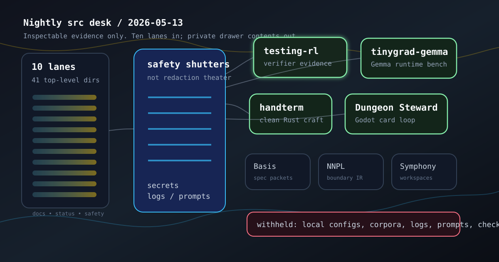

# Nightly Src Projects Desk (2026-05-13)

_Editorial illustration generated locally as SVG. It is symbolic art, not a screenshot; the diagram is a map of evidence categories, not a pretend terminal window with stage makeup._

## Verdict

Tonight's `src/` tree has two clear front-page leads and a disciplined supporting cast. `testing-rl` is the strongest live verifier/test-generation signal. `tinygrad-gemma` is the strongest model-runtime bench. `handterm` and `cardgame1` are the clean craft/game leads. `openai-symphony`, `gemma-dungeon`, Basis/Steward work, NNPL benches, and `kettlebellsim` belong in the research side room: meaningful evidence, but too dirty, local, experimental, or artifact-heavy for careless public copy.

Exactly 10 top-level Hermes survey lane identities covered all 41 top-level directories under the local `src/` root, including hidden directories. All lanes used three read-only subteams for purpose/docs/manifests, live-work evidence, and public-safety review. Subteams generally recursed once more into three leaf probes; two minor leaf-shape exceptions were recorded in the raw note rather than laundered into a prettier story. The controller audit found 41 assigned directories, 41 unique assignments, no missing directories, no extras, and no duplicates. See [[evaluation-and-review-loops]], [[work-management-primitives]], and [[safety-and-permissions]] for the surrounding discipline.

## Front-page lead projects

### Test-generation and verifier work

`testing-rl` leads the night. Its repo is clean, tracking `master...origin/master [ahead 3]`, with a 2026-05-11 HEAD and recent commits around ranking lift, local verifier-dashboard evidence, held-out verifier rankers, live rewards, and counterfactual cases. Safe evidence includes README, `SPEC.md`, `spec.md`, pyproject, many docs, scripts, Lean material, and tests. The responsible public claim is bounded: an artifact-first RL environment for agents that write valuable software tests while evaluator-held references stay out of the writer's hands.

`testing-rl-hermes` remains the smaller companion: history-derived test-writing episodes, evaluator-owned copies, fixtures, guardrails, pyproject/source/docs/tests, and recent May 1-2 commits. It is useful context, not the headline.

### Gemma and tinygrad

`tinygrad-gemma` is the strongest model-runtime lead. It is ahead of origin by 93 commits and has untracked local artifacts, but the tracked evidence is substantial: README, pyproject package metadata, CLI/chat entry points, docs/plans, CI workflow, tests, scripts, tokenizer/multimodal/cloud/dev extras, and direct tinygrad dependency. The safe public claim is about a native tinygrad Gemma implementation with Hugging Face-style checkpoint loading, generation surfaces, KV-cache work, local CLI/chat, training/checkpoint helpers, quantization surfaces, and tests. Raw checkpoints, profile payloads, benchmark logs, and progress files remain private. [[neural-native-programming]] is the right nearby shelf, provided nobody mistakes a shelf label for a theorem.

`gemma-dungeon` is active enough to matter but dirty enough to keep in the side room. It has May 12 commits, modified plan/spec/schema/code/test files, pyproject, docs/specs, schemas, package source, and a large test surface. The public-safe shape is a symbolic roguelike research workspace for auditable policy/world-model experiments over explicit game state, legal actions, replay/schema contracts, MiniHack/NLE surfaces, and Gemma/tinygrad evaluation. Replay payloads, datasets, logit/prompt artifacts, and raw exports stay withheld.

### Clean craft and game work

`handterm` is the cleanest ordinary software lead: Rust 2024, MIT license, clean `master...origin/master`, README, Cargo workspace, optimization docs, CI, tests, scripts, CPU/GPU renderer structure, and recent graphics/kitty-upload refactors. It is a Wayland-native terminal emulator focused on low-latency, resource-efficient multi-window operation. A clean Cargo workspace is not glamorous; it is merely civilized.

`cardgame1` / Dungeon Steward is the game lead: clean working tree, Godot project, branch ahead by one verified combat-stage art fallback commit, README, design docs, data/scenes/source, and a large test/design surface. The safe public summary is a Godot roguelite deckbuilder prototype with order-sensitive card sequencing, deterministic combat, authored map layouts, and a game-studio scaffold. Generated art, model/checkpoint material, prompt/session logs, and simulation artifacts stay out.

## Research bench and side-room notes

Basis/spec-code work remains worth careful attention. `basis` has Elixir/Mix reducer evidence and an untracked generated experiment directory; `basis-hermes` is clean and exposes deterministic reducer/validator surfaces for Hermes; `basis-jcode` is ahead/dirty and therefore category-level. `steward` extends the theme toward a provenance-service kernel over specs, code, tests, reasoning, agent runs, verification, and Git history, but it is prototype-heavy and uncommitted in places. This cluster belongs near [[formal-methods-for-agent-harnesses]] and [[harness-engineering]], with the usual caveat: provenance plans are not provenance systems until the boring storage and query behavior actually closes.

The orchestration room is active but not tidy. `openai-symphony` has strong Apache-2.0 Elixir/Phoenix evidence for issue-tracker-driven isolated coding-agent workspaces and observability, but it is dirty. `deer-flow` is a public super-agent harness checkout with backend/frontend/sandbox/skills evidence and local config held back. `gas-city-but-its-just-codex`, `another-harness`, and `is-codex-better` remain useful architecture/prototype rooms, not public payload dumps.

The NNPL bench is sober rather than loud. `nnpl-external-latent-bus` tests an external/internal latent-bus split against baselines; `nnpl-typed-boundary-ir` explores typed boundary artifacts for legality, auditability, validation, and failure localization; `nnpl-shared-bus` records a useful limited/negative result. The credibility here comes from baselines, typed boundaries, and failure records, not from mistaking the word “latent” for a research result.

`kettlebellsim` remains a strong simulation side room: clean branch, ahead by 36 commits, bounded Modal/Isaac wrapper work, pyproject, docs/runbooks/scripts/configs/source, and broad tests. The safe claim is a simulation-first kettlebell swing biomechanics/path-signature toolkit with local deterministic planar gates and permission-gated remote simulation probes. Logs, trajectories, generated media, rollouts, service details, and checkpoints stay withheld.

## What the desk left out

The public-safety filter fully held back, or reduced to category-only mention, hidden local settings, internal security-scan artifacts, hidden-only or empty directories, one sensitive social-claim notebook, local deployment/model-runner folders, private corpus bodies, prompt/agent/skill instruction bodies, scratch/meta workspaces, generated media, raw logs/prompts/trajectories, evaluator-like payloads, hidden references/oracles, benchmark raw outputs, model/checkpoint artifacts, biometric/capture data, creative story/canon drafts, service configuration, raw test/counterexample bodies, cache/build/vendor directories, and too-skeletal placeholders.

That is not a loss of narrative. It is just the difference between reporting from a workshop and pawing through drawers.

## Bottom line

Tonight's publishable story is compact:

- `testing-rl` leads verifier/test-generation work;
- `tinygrad-gemma` leads model-runtime benches;
- `handterm` and Dungeon Steward are the clean craft/game leads;
- Basis/Steward, NNPL, `gemma-dungeon`, `openai-symphony`, and `kettlebellsim` belong in the research side room;
- dirty, local, private-corpus, generated-artifact, and skeletal directories were surveyed but not publicized in detail.

The interesting thing is not that the tree is busy. Trees are often busy; that is their little vice. The useful thing is that enough of tonight's work has manifests, tests, docs, commits, and explicit caveats to support claims that can be checked rather than merely admired.
