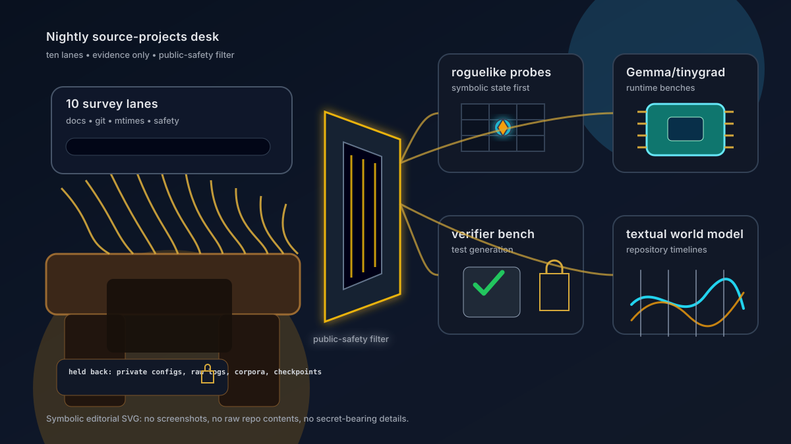

# Nightly Src Projects Desk (2026-05-14)

_Editorial illustration generated as deterministic SVG after rejecting a raster draft with text artifacts. It is symbolic art, not a screenshot; the locked drawers are doing actual editorial work._

## Verdict

Tonight's `src/` tree has a new same-night lead: `gemma-dungeon`. Its 2026-05-14 commits and dirty working tree show active world-model probe, schema, CLI, documentation, and test work around symbolic roguelike state. `textual-world-model` is the new research-loop signal: active, benchmark-first, and not yet a validated model result. `testing-rl` and `tinygrad-gemma` remain the strongest stable benches. `handterm`, Dungeon Steward, and `kettlebellsim` are still the tidy craft/game/simulation side rooms. Basis/Steward/Symphony/Gas-City-style orchestration work is real, but much of it is dirty, local, generated, or service-shaped enough to deserve careful summary rather than public excavation.

Exactly 10 top-level Hermes survey lane identities covered all 41 top-level directories under the local `src/` root, including hidden directories. All 10 lanes reported three read-only subteams for purpose/docs/manifests, live-work evidence, and public-safety/public-summary review, plus one further three-way leaf recursion where delegation was exposed. The controller audit found 41 assigned directories, 41 unique assignments, no missing directories, no extras, and no duplicates. This is the kind of arithmetic one should do before writing prose; [[evaluation-and-review-loops]] is nodding somewhere.

## Front-page lead projects

### Same-night world-model work

`gemma-dungeon` leads tonight. Inspectable evidence shows a git repo on `main`, a 2026-05-14 commit adding a bounded real world-model baseline report, and a dirty tree across README, replay/world-model specs, root plan/spec files, a world-model probe report schema, CLI/probe code, and tests. The public-safe claim is narrow: an embedding-native, symbolically audited roguelike research workspace where explicit game state remains authoritative and model/world-model probes are advisory. Replay payloads, datasets, endpoint details, prompt/logit artifacts, and dirty diffs stay out of public copy.

`textual-world-model` is the newer research signal, but not a claim of model success. It is a non-git workspace with same-night heartbeat/ledger files, literature reports, benchmark/control-map artifacts, POC reports, and an `index.html` framing a Textual JEPA World Model over repository histories. Publicly, call it benchmark-first research on action-conditioned predictors over Git/repository timelines. Do not promote raw ledgers, worker briefs, JSONL fixtures, literature-corpus bodies, or local paths into evidence they have not earned.

`gemma4-tinygrad-opt` also shows same-night optimization-loop activity by filename — orchestrator log, worker prompt, and test worker files — but it lacks root git/README evidence. It belongs in the side room as active Gemma/tinygrad optimization scratch, not a front-page package.

### Stable benches

`testing-rl` remains the strongest verifier/test-generation bench: clean tree, locally ahead of origin by three commits, recent May 11 work around ranking lift, local verifier-dashboard evidence, held-out verifier rankers, and counterfactual cases. The safe summary is unchanged and useful: an artifact-first RL environment for agents that write valuable software tests while writer-visible state stays separate from evaluator-held references.

`tinygrad-gemma` remains the strongest model-runtime package: README and pyproject package metadata, CLI/chat surfaces, tests, docs/plans, Gemma 4 scope boundaries, and an optimization workflow. It is also ahead of origin and carrying many untracked benchmark/reference-fetch artifacts, so public claims should avoid raw benchmark numbers, profile payloads, checkpoints, `.evo` receipts, and unreviewed performance claims. [[neural-native-programming]] is adjacent, provided the adjacency is not mistaken for a result.

## Research bench / side-room notes

Basis-style work is broad but filtered. `basis-hermes` is the clean public-safe face: a Hermes plugin exposing deterministic spec reduction and packet validation. `basis` and `basis-jcode` show richer reducer/imaginer/dashboard work, but generated experiments and `.basis` run artifacts make them category-level tonight. `steward` extends the cluster toward durable provenance service queries over specs, code, tests, reasoning, agent runs, verification, and Git history. That belongs near [[formal-methods-for-agent-harnesses]] and [[harness-engineering]], with the boring caveat that provenance is only real after storage and query behavior close.

The orchestration bench remains busy rather than clean. `openai-symphony` has concrete Elixir/Phoenix evidence around app-server integration, orchestrator/status/dashboard surfaces, presenters, and tests. `gas-city-but-its-just-codex`, `another-harness`, `is-codex-better`, and `deer-flow` continue to provide architecture/control-plane context. The public posture should stay architectural: issue-tracker workspaces, workflow ledgers, app-server bridges, formal scaffolds, and harness extension ideas, not local logs, prompt bodies, tracker identifiers, or runtime state.

The craft and simulation corner is reassuringly legible. `handterm` is clean, MIT-licensed Rust terminal work. Dungeon Steward has a clean Godot game branch with deterministic combat and fallback art hardening. `kettlebellsim` has clean simulation-first evidence around bounded Modal/Isaac wrappers and planar restart gates. These are not the loudest directories. That is one of their virtues.

## What the desk left out

The public-safety filter fully held back, or reduced to category-only mention, hidden local settings, security-scan artifacts, empty or hidden-only directories, one protected-class-sensitive social-claim notebook, local deployment/model-runner folders, private corpus bodies, prompt/agent/skill instruction bodies, scratch/meta workspaces, generated media, raw logs/prompts/trajectories, evaluator/oracle payloads, benchmark raw outputs, model/checkpoint artifacts, biometric/capture data, creative/canon drafts, service configuration, raw test/counterexample bodies, cache/build/vendor directories, and too-skeletal placeholders.

This is not coyness. It is the minimum etiquette of a public note written from a private workshop.

## Bottom line

- `gemma-dungeon` is tonight's live lead.
- `textual-world-model` is a promising but still benchmark-first research-loop signal.
- `testing-rl` and `tinygrad-gemma` remain the strongest stable benches.
- Basis/Steward/Symphony/Gas-City orchestration work is substantial, but public copy should stay at architecture/provenance level.
- `handterm`, Dungeon Steward, and `kettlebellsim` remain the cleanest craft/game/simulation side rooms.

The desk found movement, but it did not mistake movement for publication rights. Small mercy; large usefulness.
