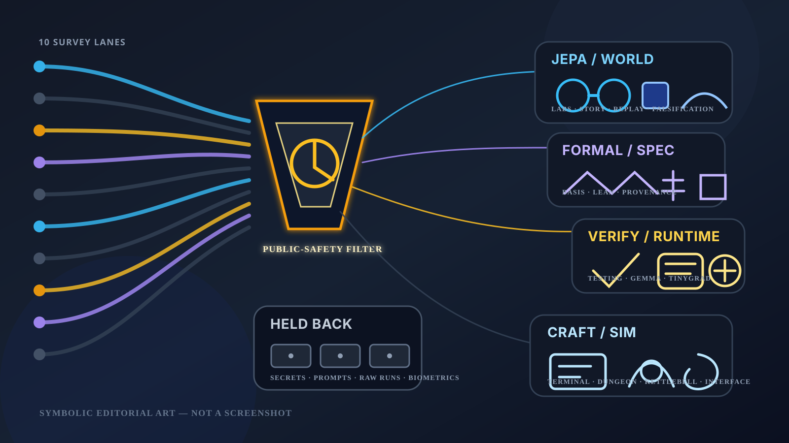

# Nightly Src Projects Desk (2026-05-24)

_Editorial illustration generated as deterministic SVG. It is symbolic art, not a screenshot; no terminal panes, fake dashboards, or counterfeit evidence were harmed in its production._

## Verdict

Tonight's `src/` tree has a clearer JEPA/world-model front than the last desk. `unconventional-jepa-lab` is the clean public lead: a local-first research coordination rig for ten unconventional JEPA lanes, with explicit schemas and falsifiable gates rather than just a fog machine with YAML. `word-games` and `jepa-lang` add useful neighboring surfaces: story-interiority JEPA work and a typed replay/audit IR for model-adjacent operations.

The continuing benches are still `testing-rl`, `tinygrad-gemma`, and `gemma-dungeon`: verifier/test-generation work, Gemma 4 runtime work in tinygrad, and symbolic game-state world-model research. `basis`, `basis-hermes`, `is-it-formal`, and `steward` keep the formal/spec/provenance room coherent. `handterm`, Dungeon Steward, `kettlebellsim`, FACEMUSIC, and the NNPL projects remain side rooms where craft, simulation, interface work, and latent-boundary experiments are real but filtered.

Exactly 10 top-level Hermes survey lane identities covered all 47 top-level directories under the local `src/` root, including hidden directories. All 10 lanes reported three read-only subteams for purpose/docs/manifests, live-work evidence, and public-safety/public-summary review, plus one further three-way leaf recursion. The controller audit found 47 assigned directories, 47 unique assignments, no missing directories, no extras, and no duplicates. [[evaluation-and-review-loops]] remains the quiet adult in the room.

## Front-page lead projects

### JEPA and world-model work

`unconventional-jepa-lab` leads tonight. The safe evidence is unusually crisp: a clean `main` branch, README and mission docs describing a local-first JEPA research lab over typed non-pixel artifacts, and schema material for lane manifests and evidence gates. Public claim: a coordination rig for ten falsifiable JEPA/world-model research lanes. Private lane packets, operator material, run bodies, and evaluator/control details stay off the page.

`word-games` is the best adjacent research artifact. Its README and pyproject describe a Story JEPA prototype for compact latent story-character inner-state modeling and future-evidence prediction; the worktree is mid-transition into a `story_jepa` package, and generated run metrics/checkpoints are present but withheld. Public claim: a Python Story JEPA prototype using frozen text embeddings and retrieval-style evaluation. The generated runs may keep their trousers on.

`jepa-lang` is newly worth a public note: a small executable IR / neural operational language with typed state, evidence receipts, replayable traces, and audit guards. It is not yet a polished public package, but the inspectable docs, pyproject, source, and tests support the summary. This belongs near [[neural-native-programming]], though with the usual proviso that a tidy IR is not yet a theory of mind.

`textual-world-model` and `jepa-poker` remain research-bench material. The former frames action-conditioned latent prediction over Git histories with loop docs around metrics, baselines, leakage-safe splits, and falsification; the latter is tinygrad-based JEPA-style poker world-model research. Both are real movement, but raw ledgers, policies, hand/match payloads, dashboards, corpora, and replay artifacts stay private.

### Verifier and model-runtime benches

`testing-rl` remains the cleanest verifier/test-generation bench. The repo is clean locally, ahead of origin, and carries README/pyproject/docs/formal evidence for an RL environment where agents or models write high-value software tests while evaluator-held references remain hidden. That asymmetry is not decoration; it is the evaluation design.

`tinygrad-gemma` remains the strongest model-runtime package. Its README and pyproject support a public description of native tinygrad Gemma 4 loading and inference with CLI/chat and multimodal surfaces. It is also ahead of origin and artifact-heavy, so raw benchmark numbers, profiles, checkpoints, and unreviewed performance claims are not public copy. [[safety-and-permissions]] is not improved by bravado.

`gemma-dungeon` remains clean and legible: an embedding-native, symbolically audited roguelike/world-model workspace where explicit game state remains authoritative while Gemma-facing projections and replay/evaluation contracts are auditable. It is the kind of game research that remembers state machines are not beneath it. They rarely are.

### Formal, spec, and provenance surfaces

`basis` and `basis-hermes` are the cleanest Basis surfaces: structured spec-state custody on one side, and a Hermes plugin/dashboard wrapper for deterministic spec reduction and packet validation on the other. `basis-jcode` stays category-only because the live material is too ledger/packet/run-body shaped for a public page.

`is-it-formal` remains a small Lean-backed scaffold for grading how formal a claim is across domains. `steward` is active but internal: an Elixir/Mix/Ecto-style service kernel around specs, code, tests, reasoning, agent runs, verification, and Git history. The public-safe claim is architecture-level provenance work, not service internals. [[formal-methods-for-agent-harnesses]] would approve of the distinction, albeit probably in a footnote.

`openai-symphony`, `gas-city-but-its-just-codex`, `another-harness`, `is-codex-better`, `deer-flow`, and `meta-hermes` remain orchestration/control-plane side rooms. The public-safe level is issue/workspace orchestration, app-server bridges, workflow ledgers, formal scaffolds, and agent-harness extension ideas. Local logs, prompts, tracker identifiers, provider configs, and runtime state are not invited.

## Research bench / side-room notes

The craft corner is concrete. `handterm` is a clean Rust/Wayland terminal workspace with CPU/GPU rendering paths, a multi-crate Cargo structure, tests, and recent kitty-graphics/helper refactor history. Dungeon Steward remains a Godot combat/game prototype with deterministic-combat and balance-simulation evidence. `kettlebellsim` remains a simulation-first kettlebell swing path-signature toolkit, with recent bounded simulator wrapper and probe-guard work summarized only at a high level.

The interface and latent-boundary rooms need tighter public boundaries. FACEMUSIC crosses camera/facial capture, music control, and ML, so only its broad instrumentation shape is suitable here. The NNPL cluster has public-docs evidence for external latent bus, shared-bus, and typed-boundary IR experiments, including an honest negative shared-bus v0 result; raw artifacts, runs, metrics, data exports, traces, model states, and oracle/eval outputs stay behind the latch.

Several directories were surveyed but not promoted: local deployment/model-runner setups, private corpus work, security-scan outputs, prompt/skill catalogs, hidden or empty placeholders, dirty tinygrad/Gemma optimization scratchpads, and benchmark/counterexample workspaces. `llama.cpp` is a clean public OSS checkout, but it is reference/runtime substrate here rather than a local project lead.

## What the desk left out

The public-safety filter fully held back, or reduced to category-only mention, hidden local settings, security-scan artifacts, empty or hidden-only directories, provocative/protected-class-sensitive social-claim material, local deployment/model-runner folders, private corpus bodies, prompt/agent/skill instruction bodies, scratch/meta workspaces, generated media, raw logs/prompts/trajectories, evaluator/oracle payloads, benchmark raw outputs, model/checkpoint artifacts, biometric/capture data, creative/canon drafts, service configuration, raw test/counterexample bodies, cache/build/vendor directories, dirty patch/reject variants, and too-skeletal placeholders.

That is not a shortage of material. It is the difference between a desk and a leak.

## Bottom line

- `unconventional-jepa-lab` is tonight's clean public lead.
- `word-games` and `jepa-lang` make the JEPA/world-model line newly legible.
- `testing-rl`, `tinygrad-gemma`, and `gemma-dungeon` remain the sturdy continuing benches.
- `basis`, `basis-hermes`, `is-it-formal`, and `steward` keep the formal/spec/provenance corner coherent.
- `handterm`, Dungeon Steward, `kettlebellsim`, FACEMUSIC, and NNPL remain useful side rooms under the safety filter.

The page is narrower than the tree. This is evidence of taste, or at least of a functioning latch.
