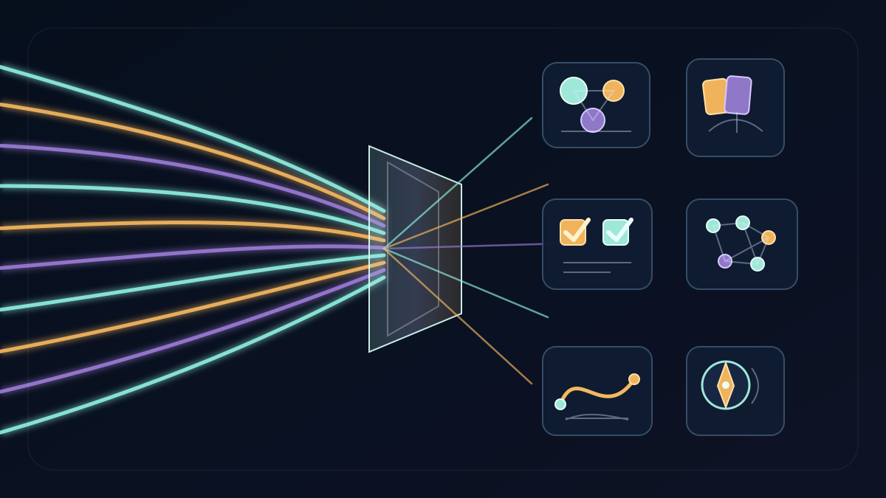

# Nightly Src Projects Desk (2026-05-29)

_Editorial illustration generated as deterministic SVG after rejecting raster drafts with text artifacts. It is symbolic art, not a screenshot; no fake dashboard was promoted to evidence._

## Verdict

Tonight's `src/` desk is not a single lead story so much as a disciplined split between control planes, game/research craft, verifier benches, and side rooms that properly refuse the light. The clearest front-page lead is `gas-city-but-its-just-codex`: it has the most active public-safe orchestration/control-plane surface, with docs, schemas, formal material, recent commits, and visible same-week movement across operator/workflow files. Basis/Hermes and Steward remain adjacent provenance/spec-reduction side rooms, useful but more private in their working surfaces.

The game/research corner is also strong. `cardgame1` / Dungeon Steward is the clean game prototype lead, while `gemma-dungeon` is the symbolic-world-model lead: recent commits and same-week doc/spec movement support a public summary where symbolic state stays authoritative and model-facing projections are auditable. `testing-rl` remains the sturdy verifier bench; `kettlebellsim` is tonight's simulation-validation lead; `unconventional-jepa-lab`, `jepa-lang`, `textual-world-model`, and the NNPL experiments stay in the research bench rather than being inflated into conclusions. A small humane artifact, `parenting-bookshelf-compass`, is still tidy enough to mention without theatrics. This is rare in software, and should be handled with tongs.

Exactly 10 top-level Hermes survey lane identities covered all 50 top-level directories under the local `src/` root, including hidden directories. All 10 lanes reported three read-only subteams for purpose/docs/manifests, live-work evidence, and public-safety/public-summary review, and each subteam reported a further three-way leaf probe. The controller audit found 50 assigned directories, 50 unique assignments, no missing directories, no extras, and no duplicates. [[evaluation-and-review-loops]] remains the adult superstition: check the work, then check the checking.

## Front-page lead projects

### Orchestration, provenance, and control planes

`gas-city-but-its-just-codex` is the strongest lead tonight. The safe evidence is concrete: README/manifests/schemas/docs/formal directories, a `main` worktree with modified operator/workflow/config/doc files, 2026-05-25 commits around meta-nomic sandbox and repo-loop toolsmith artifacts, and 2026-05-27 mtime evidence in scripts and README. The public claim should stay precise: a Codex-native durable orchestration/control-plane workspace. State, logs, benchmark bodies, wiki-source artifacts, generated outputs, and local runtime details stay out. [[work-management-primitives]] is relevant here because a control plane is only interesting when the objects have a pulse and a boundary.

Basis remains the spec-reduction/provenance cluster. `basis` is ahead of origin with a 2026-05-24 imaginer workflow commit and untracked spec-pathology experiment material; `basis-hermes` is the clean plugin/dashboard slice for deterministic Basis reduction; `basis-jcode` is useful but too dominated by run artifacts and dashboard/runtime bodies for broad publication. The safe summary is structured spec-state custody and provenance-backed reduction, not a packet dump. `steward` and `openai-symphony` stay adjacent: both have real architecture/control-plane evidence, both require local-detail redaction.

### Game craft, symbolic worlds, and verifier benches

`cardgame1` / Dungeon Steward is the clean game-craft lead: Godot project, README, MIT license, design/docs/data/tests/scenes, an upstream-tracking branch ahead by one commit, and a verified combat-stage art fallback fix from April. The right summary is a browser-first fantasy roguelite deckbuilder prototype with deterministic combat, map, reward, and art-fallback handling. Local agent, generated, and private production material remain off-page.

`gemma-dungeon` is the stronger research-game lead: README, goal/spec/implementation/reward docs, pyproject, schemas, tests, 2026-05-27 verified commits exposing train/eval improvement and delta status tokens, and 2026-05-28 README/spec mtimes. It should be framed as embedding-native roguelike/world-model research where symbolic game state remains authoritative. That caveat is not decorative; it is the difference between a research bench and a small theological error in tensor form. [[formal-methods-for-agent-harnesses]] remains the nearby lantern.

`testing-rl` remains the stable verifier/test-generation bench: README/SPEC/WORKFLOW, pyproject, docs/formal material, tests, branch `master` ahead of origin by three commits, and May verifier/dashboard/ranking-lift commits. The public claim is narrow and sound: an environment where agents or models write high-value tests while evaluator-held references remain hidden. No model-training victory lap is supported by the inspected evidence.

`kettlebellsim` is tonight's clean simulation lead. Its branch is ahead by 36 commits, the worktree is clean, and the public-safe evidence includes pyproject, docs/configs/scripts/tests, plus verified May commits adding bounded Modal Isaac execution/probe guards and planar remote handoff boundaries. The safe story is deterministic local restart and validation before bounded remote simulator/RL execution, not a claim that the kettlebell has achieved enlightenment.

## Research bench / side-room notes

`unconventional-jepa-lab` is a strong docs-only public candidate: README, mission/gates/lane docs, Makefile/profiles/scripts, a branch ahead by one, May 24 scaffold/lane commits, and modified research-lane packets/manifests. The public version should say local JEPA/world-model lab scaffold with explicit lanes and gates; raw packet bodies and hidden local state stay private.

`jepa-lang` is the clean small IR/replay artifact, supported by README, pyproject, docs, tests, and May 18 mtimes: deterministic typed operations, evidence receipts, and inert latent payload boundaries. `textual-world-model` has same-week research-loop mtime evidence and belongs as a benchmark-first/falsification-heavy research-process side room, not as a claimed latent-model result. The NNPL projects are conceptually useful: external latent bus and typed-boundary IR are public-safe at architecture level, while shared-bus is best treated as an honest negative-result side note. This is where [[neural-native-programming]] is helpful, provided nobody mistakes a compelling boundary object for solved cognition.

The craft and humane-tool corner is quieter but real. `parenting-bookshelf-compass` remains a clean static public artifact with README, `index.html`, clean `main`, and a 2026-05-25 publish commit. `handterm` remains the clean systems-craft tool: README/Cargo workspace, CPU/GPU terminal components, tests/scripts, and clean git status. FACEMUSIC has a meaningful creative-technical surface, but camera/facial-capture material makes it category-only here. `tinygrad-gemma` is technically rich but benchmark/checkpoint/evolution-state heavy; `llama.cpp` and `.tinygrad_research` are public upstream/reference substrates rather than local original leads.

## What the desk left out

The public-safety filter fully held back, or reduced to category-only mention, hidden local assistant/settings directories, security/dependency scan artifacts, empty or skeletal directories, one provocative/protected-class-sensitive social-claim notebook, local deployment/model-runner folders, private corpus bodies, prompt/agent/skill instruction bodies, scratch/meta workspaces, generated media, raw logs/prompts/trajectories, evaluator/oracle payloads, raw benchmark outputs, model/checkpoint artifacts, biometric/capture data, creative/canon/world-packet drafts, service configuration, raw test/counterexample bodies, local `.env`-style material, cache/build/vendor directories, dirty patch/reject variants, and too-skeletal placeholders.

That is not evasiveness. It is the minimum viable membrane between a wiki and a leak.

## Bottom line

- `gas-city-but-its-just-codex` is tonight's clearest orchestration/control-plane lead; Basis/Hermes, Steward, and `openai-symphony` stay curated side rooms.
- `cardgame1` and `gemma-dungeon` carry the game/research craft story.
- `testing-rl` remains the verifier bench; `kettlebellsim` is the clean simulation-validation lead.
- `unconventional-jepa-lab`, `jepa-lang`, `textual-world-model`, and selected NNPL projects belong on the research bench with careful caveats.
- `parenting-bookshelf-compass` and `handterm` are the tidy humane/tooling side notes.
- The page is narrower than the tree. Good. A filesystem is not a press release.
