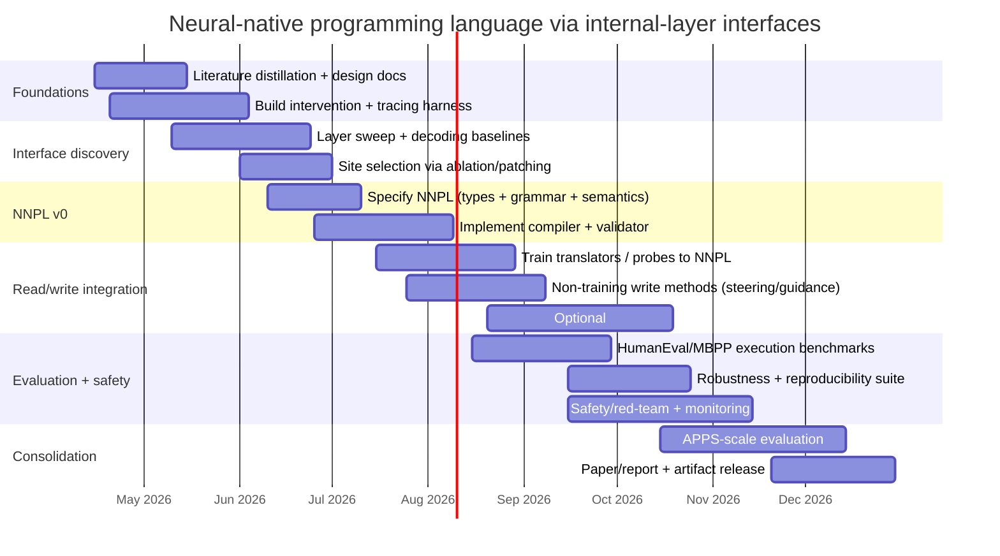

# Neural-Native Programming via Direct Interfaces to Transformer Internal Layers

## Ingest note
This raw source preserves the user-provided draft as submitted in chat on 2026-04-10. The citation markers in the text were session-local placeholders rather than a resolved bibliography, so the companion ingest batch resolves those placeholders into explicit raw source pages under `raw/papers/` and `raw/articles/`.

## Submitted text

# Neural-Native Programming via Direct Interfaces to Transformer Internal Layers

## Executive summary

A “neural-native” programming language (NNPL) that is generated and manipulated **as internal activations**—rather than emitted as text tokens—sits at the intersection of three mature research threads: (i) **Transformer internals as iterated representation refinement** (residual stream “read/write” computation), (ii) **latent-space / continuous program representations**, and (iii) **vector-symbolic / hyperdimensional representations** that support compositional structure under noise.

The core promise is not mystical: it’s a bet that **token strings are an awkward bottleneck** for model-to-model code generation when the model’s “native” computation already occurs in high-dimensional spaces. The core danger is also not mystical: **internal representations are entangled, basis-dependent, and unstable across layers and variants**, and direct activation interfaces can become opaque channels that are hard to audit or constrain.

A rigorous research plan therefore has to answer two uncomfortable questions early:

1) **Can we define a latent program space with clean semantics** (types, composition rules, executability) that is *robust to noise* and *invertible enough* to debug? (Inspiration: hyperdimensional computing; HRR; VSA; typed VSA encodings of programming languages.)
2) **Can we interface that space to internal layers reproducibly**—including both *read* (decode latent programs from activations) and *write* (inject latent program state into activations)—without collapsing back into “just another tokenization”? (Inspiration: tuned lens, activation steering/addition, intervention libraries, adapters/LoRA, causal tracing/model editing.)

If you do not make semantics-and-auditability first-class, NNPL will likely become: *a high-bandwidth steganographic channel that occasionally compiles*. That’s not a programming language; it’s a liability.

## Motivation and novelty

Modern Transformers compute by repeatedly updating a shared high-dimensional state (the residual stream), with attention and MLP sublayers reading from and writing back into that state. This makes “latent program manipulation” conceptually plausible: you can treat a subset of internal states as a structured, editable workspace rather than as a transient step on the way to next-token logits.

The novelty in your specific framing is **not** “continuous prompts” (already common) nor “parameter-efficient adaptation” (adapters/LoRA), but the stronger claim:

- **Language = a space of executable structures defined directly in activation geometry**, and
- **Generation = producing those structures by hooking internal layers**, bypassing the vocabulary projection as the *primary* interface.

This resembles (but is not identical to) prior work in:
- **Latent predictions / decoding at intermediate layers** (logit lens variants; tuned lens).
- **Activation-level control** (e.g., contrastive activation addition; activation addition; gradient guidance that perturbs hidden activations).
- **Neural program induction in latent spaces** (continuous/discrete latent programs; latent program networks).
- **Vector-symbolic / hyperdimensional computation** for compositional structure under noise (HDC/VSA; HRR).

The differentiator you should defend, empirically, is: **Does direct-layer interfacing yield measurable gains** in at least one of: (i) pass@k on code benchmarks under fixed compute, (ii) robustness to perturbations / paraphrase, (iii) controllability and auditability, or (iv) sample efficiency for fine-tuning.

## Background and prioritized literature

Transformers are the dominant architecture; your project depends on a precise understanding of *where* meanings live in the stack and *how* to intervene.

A prioritized reading stack (primary/seminal first) that directly supports NNPL design:

**Transformer computation as a manipulable substrate**
- The original Transformer architecture.
- A mechanistic framework emphasizing the residual stream as the central shared state and “read/write” pathway.

**Layerwise decoding and representation geometry**
- Tuned lens: trains per-layer affine “translators” to decode intermediate hidden states more reliably than the classic logit lens, explicitly addressing layer-to-layer basis changes (rotation/shift/scale).
- Probing and analysis methods surveys + structural probes for discrete structures in hidden spaces (useful both as measurement and as a warning about probe brittleness).

**Activation interventions as “write primitives”**
- Contrastive Activation Addition (CAA): adds steering vectors computed from activation differences to steer behavior during forward passes.
- Activation Addition / activation engineering: steering without optimization (related family of methods).
- PPLM: gradient-based guidance that explicitly **pushes hidden activations** during sampling (useful as a canonical “activation-space control loop,” and it contains an explicit ethics section noting dual-use).
- Tooling for interventions: pyvene (configurable interventions, including trainable ones) and systems like NNsight/NDIF or baukit that support tracing/overwriting internals.

**Discovering stable “primitives” in activations**
- Sparse autoencoders / dictionary learning to extract “features” as linear combinations of neuron activations (monosemanticity agenda). This is relevant if NNPL primitives are to be interpretable or at least stable.
- Superposition/polysemanticity toy models: a direct warning that features can be packed in ways that make naive coordinate-wise interpretation unreliable.

**Latent-space programs and neural-symbolic interfaces**
- Discrete latent codes for program synthesis using VQ-VAE-style bottlenecks, demonstrating that program structure can be mediated by latent variables and then decoded.
- Searching latent program spaces / latent program networks (explicitly treating program induction as search in a latent continuous space).
- Formal “programming languages for Transformers” (RASP and variants like B-RASP / C-RASP) as a conceptual mirror: they provide *symbolic languages that map to Transformer computation*, which helps you reason about compositionality and depth requirements (even if your NNPL goes the opposite direction: from internals to language).

**Hyperdimensional / vector-symbolic representations (for a noise-tolerant NNPL core)**
- Hyperdimensional computing as computing with very high-dimensional random vectors and operations that produce new high-dimensional vectors.
- HRR: circular convolution as binding to represent compositional structure in fixed-width vectors (classic variable binding story).
- Vector symbolic architectures as a response to compositionality challenges.
- “Doug”: a more recent, unusually on-point example of a **typed** programming language encoded in a VSA representation, explicitly arguing types as points in an embedding space and structural similarity as geometric proximity.

## Research questions and hypotheses

A rigorous NNPL program has to separate *what is being invented* (the language) from *what is being connected* (the interface into a Transformer). The research questions should be framed so that negative results are informative, not just “it didn’t work.”

Key research questions (RQs):

- **RQ1: Existence of a usable latent program space.** Can we define a vector program representation that supports (a) composition, (b) type constraints, (c) deterministic execution via a compiler/interpreter, and (d) robustness to small perturbations? (Motivation: HDC/VSA/HRR and typed VSA encodings.)
- **RQ2: Interface locality and layer selection.** Which internal sites produce the best tradeoff between semantic abstraction and controllability (e.g., mid-layer residual stream vs. later layers closer to outputs), and does that generalize across architectures? (Evidence that mid-layer MLP steps mediate factual recall suggests that “meaningful computation” is often mid-stack, but your target is *program structure*, not just facts.)
- **RQ3: Read/write symmetry.** Can we build *invertible enough* encoder/decoder pairs between NNPL objects and internal activations so that “generate → compile → execute → debug” is reproducible? (Tuned lens exists partly because naive unembedding is brittle due to layer-wise basis changes.)
- **RQ4: Advantage over token-code baselines.** Under matched training data and compute, does NNPL yield better functional correctness, robustness, or controllability than generating normal code text? (HumanEval/APPS/MBPP provide reference harnesses—though you’ll need a compiler-to-Python or direct runtime.)
- **RQ5: Safety and auditability.** Does bypassing the logit interface increase the risk of hidden malicious behavior or safety circumvention, and can we build effective monitors at the activation/language boundary? (Representation engineering literature explicitly highlights both defensive and offensive potential; PPLM also notes dual-use.)

Testable hypotheses (Hs) that you can actually falsify:

- **H1 (robust compositionality):** An NNPL core built on VSA-style binding/bundling and/or discrete codebooks yields higher tolerance to activation noise (measured as “compile+test success under perturbation”) than a purely continuous unstructured latent vector stream.
- **H2 (layer advantage):** A mid-layer interface (chosen via ablations/causal tracing-style localization) achieves higher functional correctness and lower variance across decoding runs than a “last-layer” interface that effectively replicates logits in disguise.
- **H3 (read/write consistency):** Training layer-specific translators (tuned-lens-style) plus a constrained NNPL grammar reduces run-to-run divergence of decoded programs compared to a single global linear probe.
- **H4 (control):** Activation-level steering primitives (CAA/activation addition family) can reliably enforce NNPL syntactic/typing constraints during generation, reducing invalid programs without heavy fine-tuning.

## Language design principles

A neural-native programming language has to pick a side: **Is it a human-facing language that happens to live in vectors, or a model-facing IR with a compiler?** For your stated goal (“models generate code for it”), the strong recommendation is: **make NNPL a model-facing IR** with explicit, testable semantics, and only later invent ergonomic human syntax if it’s still needed.

Design principles that follow from prior art:

**High-dimensional primitives should be error-correcting, not just expressive.**
Hyperdimensional computing emphasizes that very high-dimensional random vectors and algebraic operations can support robust computation under noise; HRR similarly uses circular convolution binding to represent compositional structures in fixed width. That robustness property is the *real* reason to go high-dimensional—not “more bits per symbol,” but graceful degradation and cleanup.

**Compositionality should be structural, not emergent.**
If you let the model “implicitly” invent composition in an unconstrained latent space, you will fight superposition/polysemanticity and basis drift forever. Enforce composition with explicit operators (bind, bundle/superpose, permute/role tagging, scoped references) drawn from VSA/HDC traditions, or enforce explicit structure via a typed latent grammar.

**Ground semantics in execution.**
NNPL objects must compile or interpret deterministically. The compiler can target a conventional runtime (e.g., Python/LLVM IR/WASM) initially. The point is that “meaning” is anchored by tests, not only by reconstruction loss. (This mirrors how HumanEval/APPS evaluate functional correctness through tests.)

**Prefer “geometry + discrete constraints” over pure continuity.**
Pure continuous representations are easy to optimize but hard to audit. VQ-VAE-style discrete latents show one way to get discrete structure with neural training; typed VSA encodings (e.g., Doug) show another way to place types/terms in an embedding space while preserving decoding and similarity structure.

**Treat syntax as a verification layer, not the primary carrier.**
A pragmatic pattern: NNPL is a graph or sequence of vectors **plus** a compact set of discrete validators (types, arity rules, effect rules). This keeps the main channel high-dimensional while preserving “this program is valid” as a crisp predicate.

### Candidate NNPL representations

To make the design space explicit, here are the main encoding families worth testing first:

| Encoding scheme | What the “program” is | Composition mechanism | Determinism & auditability | Likely strengths | Likely failure modes |
|---|---|---|---|---|---|
| Continuous vector stream | Sequence of ℝ^d vectors (no quantization) | Learned composition in decoder; optional constraints | Low unless you add strong validators | Smooth optimization; easy adapters | Drifts, ambiguity, hard debugging; “latent mush” |
| VQ / codebook latents | Sequence of discrete indices with learned embeddings | Grammar over indices; embeddings carry geometry | Higher (discrete spine) | Reproducibility; error correction; compression | Codebook collapse; “just tokens again” unless embeddings are semantically structured |
| VSA/HDC hypervectors | Fixed-width hypervectors with binding/bundling/permutation | Algebraic ops (bind, bundle, unbind) | Medium–High if cleanup memory exists | Noise tolerance; interpretable ops | Retrieval/cleanup complexity; designing good role/filler scheme |
| Typed latent AST graph | Nodes/edges are vectors + discrete type tags | Graph composition + types | High | Best debugging; easiest compilation | Harder generation; needs robust pointer/reference scheme |
| “Feature language” via SAEs | Program primitives are sparse features in a learned dictionary | Composition via sparse activation patterns | Potentially high if features stable | Could align with internal model features | Feature instability; SAE dependence on model + training recipe |

A strong opinion (with a skeptical edge): for your goal, **start with a discrete spine** (typed latent AST, or VQ/codebook + grammar). Continuous-only NNPLs are seductive but tend to produce artifacts that can’t be confidently re-executed or audited.

## Interfacing methods and architecture

Interfacing “directly with internal layers” requires you to decide what the interface *is*: a layer index, a tensor location, a read/write protocol, and training objectives. Existing work already provides building blocks for each component.

### System-level architecture

A minimal but rigorous NNPL system can be decomposed into:

1) **Interface site(s):** specific internal activations (typically residual stream at one or more layers, possibly at specific token positions).
2) **Read head:** maps internal activations → NNPL objects (vectors, codebook indices, graph updates). Tuned-lens-style translators are a strong baseline for “layer basis drift.”
3) **Write head / intervention mechanism:** NNPL state influences subsequent computation (steering vectors, learned adapters, or explicit overwrites).
4) **Compiler/interpreter:** NNPL → executable target (or NNPL runtime).
5) **Checker/monitor:** validates NNPL well-formedness, types, and safety policies at the boundary.

A helpful mental model is “neural external memory”: classic differentiable memory systems formalize read/write via vectors and heads. While Transformers differ, the analogy clarifies what “write” actually means: you are implementing controlled overwrites/additions in a high-dimensional workspace.

```mermaid
flowchart LR
  Spec[Task spec: text or latent] --> LM[Transformer model]
  LM -->|activation at layer L*| ReadHead[Read head: translator/probe]
  ReadHead --> NNPL[NNPL program object<br/>(vector stream / codebook / AST graph)]
  NNPL --> Checker[Type + validity + policy checks]
  Checker --> Compiler[Compile/interpret to executable form]
  Compiler --> Run[Execute tests / runtime]
  NNPL -->|optional| WriteHead[Write head: steering / overwrite / adapter]
  WriteHead --> LM
  Run --> Score[Metrics: pass@k, robustness, reproducibility]
```

### Concrete interfacing techniques

Below is a comparison table of candidate “layer interface” methods. The key distinction is whether you need **training** (adapters/translator heads) versus **test-time interventions** (steering, patching), and whether the method supports *writes* as well as *reads*.

| Technique family | Read mechanism | Write mechanism | Training requirement | What it’s good for | Main liabilities |
|---|---|---|---|---|---|
| Linear probes / affine translators | Linear/affine map from hidden state to NNPL symbols; tuned-lens paradigm is per-layer affine translation | Usually none (read-only) | Low–Medium (probe training) | Fast baselines; diagnosing where info lives | Can be brittle; may not yield executable structure unless NNPL constrained |
| Tuned-lens-style layer translators | Per-layer affine “translator” that compensates for representation drift | Indirect (can enforce consistency via decoding constraints) | Medium | Stable decoding from mid-layers; reproducibility studies | Still mostly read-centric; doesn’t automatically give write protocol |
| Activation addition / steering | Optional: interpret steering direction as NNPL control signal | Add vectors to residual stream or targeted sites during forward pass | None to low (compute steering vectors from data) | Constraint enforcement; style/behavior control; cheap iteration | Can be hacky; may create side effects; safety bypass risk |
| Gradient guidance on activations (PPLM-like) | Can decode intermediate activations as “state” | Gradient updates push hidden activations during sampling | None to low (attribute model training optional) | Strong control loop without weight updates | Slow; can destabilize generation; dual-use explicitly noted |
| Trainable intervention layers (pyvene) | Read/write hooks configurable; can include trainable components | Overwrite/patch/learned interventions at chosen modules | Medium | Systematic intervention experiments; ablations | Engineering complexity; still needs NNPL semantics |
| Adapters / LoRA for NNPL I/O | Add NNPL input embeddings into blocks; output head maps hidden ↔ NNPL | Learned conditioning and generation in chosen subspaces | Medium–High (fine-tuning) | Strong performance; scalable adaptation | Risk of collapsing back to token-like behavior; requires data + compute |
| Causal tracing / activation patching for site selection | Diagnostic: locate which layers/heads mediate desired info | Not primary write path; helps choose where to write | Medium (analysis heavy) | Choosing L* rationally; debugging failures | Can be expensive; results may be task-specific |
| Weight editing (ROME/MEMIT) | Not mainly read | Write by editing weights for specific knowledge | High (offline editing computation) | Persistent “firmware updates” to NNPL behavior | Not suitable as primary interface; changes model internals globally |

### Which layers and which tensors?

A disciplined way to choose interface sites is:

- Start with the **residual stream** at a candidate mid-layer L* because it aggregates contributions from attention and MLP and is the natural “workspace” emphasized by mechanistic frameworks.
- Use tuned-lens-style decoding error curves to detect where representations become stable for your NNPL symbols.
- Use causal tracing / activation patching methodology to test whether interventions at L* causally affect NNPL validity and executability (not just token outputs).

This avoids a common self-deception: picking a layer because it “feels semantic,” when in fact your decoder is just learning to compensate for a bad site.

## Evaluation methodology, safety, and failure modes

### Benchmarks and measurable success criteria

A credible NNPL project needs **execution-based evaluation** from day one.

**Primary functional correctness metrics**
- Use established code-generation harnesses as downstream targets by compiling NNPL → Python (or another executable target) and running test suites:
  - HumanEval measures functional correctness from docstrings with pass@k sampling.
  - MBPP provides ~1k basic problems with solutions and tests.
  - APPS provides 10k problems with multiple test cases, spanning difficulty.

**Suggested success criteria (concrete, falsifiable)**
- **Validity rate:** ≥ 95% of generated NNPL artifacts pass structural + type checks (for a typed NNPL) before compilation.
- **Compile success:** ≥ 90% compile to executable target without repair heuristics.
- **Pass@1 / Pass@10:** On a chosen subset (e.g., HumanEval), demonstrate statistically significant improvement over a matched baseline that generates Python directly, at equal sampling budget. (The Codex/HumanEval paper demonstrates pass@k methodology and repeated sampling effects, which provides an evaluation template.)
- **Robustness to perturbation:** Under injected Gaussian noise in the interface activations or NNPL vectors, pass rate degrades gracefully (e.g., ≤ 10% absolute drop at a specified noise level), supporting the claim that high-dimensional NNPL is error-tolerant. (This is the core motivation behind HDC/VSA-style representations.)
- **Reproducibility:** With deterministic inference settings, decoded NNPL programs should be stable up to a small distance threshold, and compilation results should be identical across runs.

### Expressivity metrics beyond pass@k

Pass@k is necessary but not sufficient. NNPL claims “more expressive than text tokens” must be operationalized:

- **Description length:** For equivalent semantics (same compiled program), compare the number of generation steps required (NNPL steps vs token steps).
- **Compositional generalization:** Test whether NNPL systems generalize to longer compositions (deeper ASTs, more variables) better than token baselines. RASP/B-RASP/C-RASP give formal hooks for thinking about depth/expressiveness and can inspire synthetic compositional benchmarks even if they don’t directly evaluate NNPL.
- **Type error localization:** If using typed NNPL, measure whether type errors localize to specific substructures (debuggability), aligning with the motivation of typed VSA encodings.

### Safety and failure modes

This is where skepticism is mandatory.

**Failure modes (technical)**
- **Basis drift and representation instability:** Layerwise transformations can rotate/shift representations; tuned lens exists in part to address brittleness of naive decoding.
- **Superposition and polysemanticity:** Many “features” can share representation capacity; naive primitives may not be isolatable.
- **Hidden-channel behavior:** High-dimensional NNPL carriers can encode information not captured by your compiler/validator (steganography-in-the-latents). This is especially dangerous if you treat only the compiled output as “the program.”
- **Distribution shift:** NNPL decoders trained on one model version or precision setting may fail silently on another.

**Safety risks (misuse and governance)**
- **Circumventing safety constraints:** Representation engineering work explicitly notes that activation-level methods can be used defensively *and* offensively (including circumventing safety measures), and PPLM explicitly acknowledges near-symmetric dual-use potential (e.g., detoxification vs increasing toxicity).
- **Auditability gap:** If critical decisions live in latent NNPL artifacts that are not human-readable, safety review becomes harder.

**Mitigations you should design in, not bolt on**
- **Boundary monitors:** Treat NNPL decoding as a security boundary; log and inspect NNPL artifacts, not only compiled code. Use anomaly detection in NNPL space and/or intermediate predictions (tuned lens work suggests latent prediction trajectories can be used for malicious input detection).
- **Constrained semantics:** Prefer typed NNPL with a small, auditable core calculus (even if not Turing-complete initially). The “Doug” direction is relevant here: types as constraints that restrict program space.
- **Deterministic compilation + reproducible builds:** If the same NNPL artifact can compile differently depending on environment, you’ve created an exploit surface.
- **Red-team tasks:** Include adversarial code-generation tasks and “latent smuggling” tests as first-class evaluation from mid-project onward.

## Implementation roadmap and expected impact

This roadmap assumes model family/scale/compute are open-ended and focuses on **experiment sequencing** that yields publishable, decision-forcing results even if NNPL ultimately fails.

### Milestones, experiments, datasets, compute estimates, deliverables

**Phase: Interface prototyping and measurement**
- Build a tracing + intervention harness using existing tooling (intervention libraries and hook-based tracing).
- Establish “read baselines”: linear probes vs tuned-lens-like translators to decode candidate NNPL symbols from multiple layers; quantify decoding stability vs layer.
- **Deliverable:** A reproducible benchmark notebook + codebase that can (a) select layer sites, (b) decode NNPL artifacts, (c) overwrite/add vectors, and (d) measure downstream compilation/test performance.

**Phase: NNPL v0 — executable latent IR**
- Choose NNPL representation *explicitly* (recommendation: typed latent AST graph or VQ/codebook + grammar).
- Implement compiler NNPL → Python (or a tiny bytecode VM).
- Curate datasets: start with HumanEval + MBPP (small, test-driven), then scale to APPS once stable.
- **Deliverable:** NNPL spec (formal-ish), compiler, validator/type-checker, and a reference interpreter.

**Phase: Write protocol — constraint enforcement during generation**
- Test non-training interventions: activation addition / CAA to enforce structural constraints (e.g., “next node must be well-typed”), and PPLM-like gradient guidance as a stronger but slower control loop.
- If needed, move to trainable adapters/LoRA that map between latent NNPL states and internal activations, aiming to reduce invalid outputs without heavy full fine-tuning.
- **Deliverable:** A “write API” and ablation report demonstrating causal control (not just correlation).

**Phase: Scaling and hardening**
- Add robustness tests (noise injection, paraphrase, adversarial specs).
- Add safety monitoring and latent-smuggling red-team evaluations, integrating representation-engineering risk analysis.
- **Deliverable:** End-to-end evaluation report with pass@k, robustness, reproducibility, and safety metrics.

Compute estimates (open-ended but bounded by method choice):
- Probe/tuned-lens translator training is typically modest compared to full fine-tuning because it trains small affine maps per layer.
- Adapter/LoRA training is designed to reduce trainable parameters and memory footprint relative to full fine-tuning, enabling iteration on limited compute.
- Activation steering methods (CAA/ActAdd) can often be computed from datasets of positive/negative examples without weight updates, making them cheap to iterate but potentially expensive to validate thoroughly.

### Timeline



### Expected outcomes and impact

If successful, the most credible impacts are:

- **A new executable intermediate representation optimized for model generation**, where high-dimensional structure improves robustness and enables enforcement of constraints during generation. (This aligns with latent program synthesis threads showing programs can be mediated through structured latent variables.)
- **A principled “activation I/O” interface** that replaces ad hoc hooking with reproducible read/write protocols (building on tuned lens decoders, intervention frameworks, and steering methods).
- **Improved audit tools**: if NNPL artifacts are constrained and logged, they can become *more* inspectable than raw activation soup—especially if primitives are grounded via SAEs/features or typed constraints.

If it fails, a well-designed project still yields valuable results:
- Negative evidence that internal-layer interfaces do **not** offer advantages over token code generation under realistic constraints, or that the audit/safety costs overwhelm gains. This is still publishable if measured carefully against strong baselines like HumanEval/APPS-style functional evaluation.
