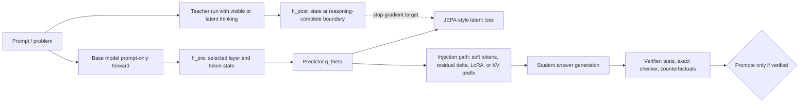

# Hidden-State JEPA Reasoning Shortcut Literature Source Packet

## Retrieval metadata

- Retrieval date: 2026-05-05.
- Primary local wiki context read: `concepts/neural-native-programming.md`, `queries/neural-native-programming-via-direct-interfaces-to-transformer-internal-layers.md`, `queries/neural-native-programming-research-program.md`, and `concepts/on-policy-self-distillation.md`.
- arXiv metadata retrieval: `https://export.arxiv.org/api/query?id_list=2301.08243,2404.08471,1807.03748,2310.02226,2403.09629,2412.06769,2401.15077,2401.10774,2404.16710,2203.14465,2305.02301,2407.06023,2112.00114,2203.11171,2211.17192,2302.01318,1807.03819,2107.05407,2404.02258,2207.06881,2207.07061`.
- Hugging Face API retrieval for model availability:
  - `https://huggingface.co/api/models/google/gemma-4-E2B-it`
  - `https://huggingface.co/api/models/google/gemma-4-E4B-it`
  - `https://huggingface.co/api/models/google/gemma-4-26B-A4B-it`
  - `https://huggingface.co/api/models/google/gemma-4-31B-it`
  - `https://huggingface.co/api/models/Qwen/Qwen3-4B`
  - `https://huggingface.co/api/models/deepseek-ai/DeepSeek-R1-Distill-Qwen-7B`
- Negative evidence: configured `web_search` failed because Firecrawl was not configured, so discovery used known candidate papers plus direct arXiv/Hugging Face API grounding.

## Diagram of the proposed experiment

## Source map and quality assessment

| Source | Year | Main point | Relevance to pre-thinking → post-thinking hidden-state shortcut | Quality / directness | Caveat |
|---|---:|---|---|---|---|
| I-JEPA — Self-Supervised Learning from Images with a Joint-Embedding Predictive Architecture (`arXiv:2301.08243`) | 2023 | Predict target image-block representations from context representations without pixel reconstruction. | Establishes the latent-prediction pattern: predict embeddings, not surface outputs. | High quality, low directness: strong SSL paper, vision domain. | Vision masking is not autoregressive LLM reasoning; target states are not reasoning-complete transformer states. |
| V-JEPA — Revisiting Feature Prediction for Learning Visual Representations from Video (`arXiv:2404.08471`) | 2024 | Predict video features over masked spatiotemporal regions. | More temporally analogous to predicting later latent states. | High quality, low-to-medium directness. | Video dynamics are not the internal dynamics of a reasoning LLM. |
| Contrastive Predictive Coding (`arXiv:1807.03748`) | 2018 | Learn representations by predicting future latent observations. | Foundational support for latent future prediction as a self-supervised objective. | High quality, low directness. | Contrastive future prediction does not imply causal equivalence to skipped reasoning. |
| Pause Tokens — Think before you speak (`arXiv:2310.02226`) | 2023 | Learned pause tokens give a language model extra hidden-vector manipulation before output. | Shows that hidden computation before output can matter without visible thought tokens. | Medium-high quality, high conceptual relevance. | Still spends sequential transformer steps; it does not jump to the final state. |
| Quiet-STaR (`arXiv:2403.09629`) | 2024 | Language models can learn to generate internal rationales before token prediction. | Supplies a self-supervised way to create teacher reasoning traces. | Medium-high quality, medium directness. | Thoughts are text-like rationales; faithfulness is not guaranteed. |
| Coconut — Training LLMs to Reason in a Continuous Latent Space (`arXiv:2412.06769`) | 2024/2025 | Uses the last hidden state of reasoning tokens as continuous latent thoughts. | Closest source to the claim that reasoning can be moved out of ordinary text space. | Medium quality, high directness but still emerging. | It performs sequential latent reasoning; it does not prove one-shot state jumping. |
| STaR (`arXiv:2203.14465`) | 2022 | Bootstraps reasoning by training on rationales that lead to correct answers. | Shows teacher-generated reasoning traces can become durable model behavior. | High quality, medium directness. | Token rationale distillation, not hidden-state distillation. |
| Distilling Step-by-Step (`arXiv:2305.02301`) | 2023 | Smaller models can learn from rationales plus labels with less data. | Supports amortizing reasoning into a student. | High quality, medium directness. | Distills explanations/labels, not pre/post residual states. |
| Distilling System 2 into System 1 (`arXiv:2407.06023`) | 2024 | Self-supervised methods compile higher-quality System-2 outputs back into direct generations without intermediate reasoning. | Very strong conceptual precedent for “skip the slow thinking at inference.” | Medium-high quality, high conceptual relevance. | Behavior-level distillation, not JEPA hidden-state transition. |
| Show Your Work / Scratchpads (`arXiv:2112.00114`) | 2021 | Intermediate scratchpads improve algorithmic computation. | Explains why the teacher trace can contain real useful computation. | High quality, medium directness. | Explicit token scratchpads, not latent shortcuts. |
| Self-Consistency for CoT (`arXiv:2203.11171`) | 2022 | Sample multiple reasoning paths and marginalize final answers. | Good teacher signal for distillation; shows many reasoning paths may lead to one answer. | High quality, medium directness. | Multiple valid paths make a single deterministic post-state target questionable. |
| EAGLE (`arXiv:2401.15077`) | 2024/2025 | Predicts second-to-top-layer future features for speculative sampling. | Closest engineering analogue to predicting future LLM hidden features. | High quality, high directness for feature prediction. | Short-horizon decoding acceleration with verification, not long-horizon reasoning-state skipping. |
| Medusa (`arXiv:2401.10774`) | 2024 | Adds multiple decoding heads to predict future tokens from the current state. | Shows current hidden states can support multi-step token forecasts. | Medium-high quality, medium directness. | Token heads, not post-thinking residual/KV state. |
| LayerSkip (`arXiv:2404.16710`) | 2024 | Trains intermediate layers for early exit and self-speculative decoding. | Evidence for shortcutting some transformer computation with verification. | High quality, medium directness. | Shortcuts layer depth, not deliberation time. |
| Speculative Decoding (`arXiv:2211.17192`) and Speculative Sampling (`arXiv:2302.01318`) | 2022/2023 | Draft fast, verify with target model while preserving output distribution. | Architectural lesson: approximations can be useful when exact verification remains. | High quality, medium directness. | Does not remove target computation; acceptance drops on hard continuations. |
| CALM (`arXiv:2207.07061`), Mixture-of-Depths (`arXiv:2404.02258`), Universal Transformers (`arXiv:1807.03819`), PonderNet (`arXiv:2107.05407`) | 2018–2024 | Adaptive compute can vary by token/example. | Supports allocating less compute to easy cases and more to hard ones. | Medium-to-high quality, low-to-medium directness. | Compute gating is not equivalent to reconstructing a post-thinking state. |
| Recurrent Memory Transformer (`arXiv:2207.06881`) | 2022 | Uses recurrent memory tokens across segments. | Shows continuous memory state can be trained and reused. | Medium-high quality, medium directness. | Memory/compression, not skipping reasoning. |

## Model availability observations

Hugging Face model API returned public, non-disabled Google Gemma 4 entries as of 2026-05-05:

| Model API ID | Observed status | Observed tags / license | Practical note |
|---|---|---|---|
| `google/gemma-4-E2B-it` | public, non-disabled; created 2026-03-02; modified 2026-04-28 | `gemma4`, `any-to-any`, `license:apache-2.0` | Most attractive Gemma-family first local target. |
| `google/gemma-4-E4B-it` | public, non-disabled; created 2026-03-02; modified 2026-04-28 | `gemma4`, `any-to-any`, `license:apache-2.0` | Stronger small local target if hidden-state extraction works cleanly. |
| `google/gemma-4-26B-A4B-it` | public, non-disabled; created 2026-03-11; modified 2026-04-28 | `gemma4`, `image-text-to-text`, `license:apache-2.0` | Likely too heavy for first local training pass; candidate teacher/inference model. |
| `google/gemma-4-31B-it` | public, non-disabled; created 2026-03-11; modified 2026-04-28 | `gemma4`, `image-text-to-text`, `license:apache-2.0` | Not a sensible first hidden-state training target. |
| `Qwen/Qwen3-4B` | public, non-disabled; created 2025-04-27; modified 2025-07-26 | `qwen3`, `license:apache-2.0` | Practical alternative with stronger explicit reasoning-mode ecosystem. |
| `deepseek-ai/DeepSeek-R1-Distill-Qwen-7B` | public, non-disabled; created 2025-01-20; modified 2025-02-24 | `qwen2`, `license:mit` | Useful reasoning-trace teacher; less clean for same-model hidden-state targets if architecture differs. |

## Synthesis notes

- The proposed method is plausible as a research experiment, especially if phrased as **amortized latent reasoning** rather than magic reasoning compression.
- The exact JEPA analogy is imperfect: JEPA target embeddings are meant to be stable semantic representations, while transformer post-thinking hidden states are position-, layer-, KV-cache-, and trajectory-dependent.
- A single vector is probably the wrong first target. Better targets are a small sequence of latent soft tokens, a projected feature state at a fixed boundary, or a prefix/KV summary after easier diagnostic stages pass.
- Verification is not optional. The strongest adjacent acceleration systems keep a verifier or target-model correction loop, which is a useful warning from the literature rather than a bureaucratic inconvenience.
